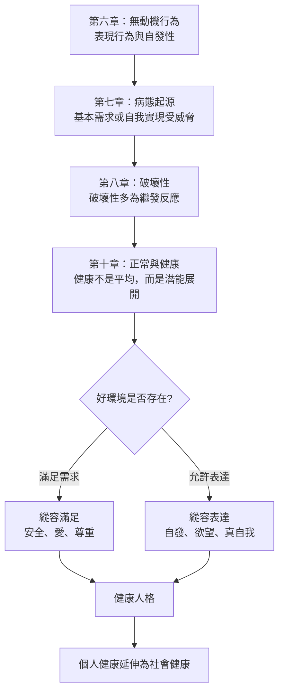

# 《動機與人格》第十章：什麼是正常和健康？

> 來源：使用者提供之《動機與人格》第十章〈什麼是正常和健康？〉Notion 初整理。  
> 頁碼：約 193–213。  
> 用途：補強星盤與星骰中的「正常、健康、被動適應、固有人性、潛能展開、健康社會」解讀。  
> 整理原則：本文為二次整理版本，避免逐字搬運原書內容，重點放在心理學概念與星盤／星骰應用。

---

## 一、本章核心重點

### 1. 「正常」不等於「健康」

心理學裡的「正常」常被混用成統計平均、社會成規、文化標準、被動適應或多數人的樣子。

但大多數人都這樣，不代表這就是健康。平均值只能描述現象，不能直接成為健康標準。

### 2. 「適應良好」可能是危險概念

一個人能融入環境、不惹麻煩、符合社會期待，不一定代表心理健康。

如果環境本身有問題，那麼過度適應反而可能代表此人壓抑了自己的基本需求、真實感受與固有天性。

### 3. 健康應以固有天性與潛能發揮為基礎

馬斯洛主張，健康不應只用外在適應程度衡量，而要看人的基本需求、固有天性、能力與潛能是否被照顧與展開。

這讓健康不只是「沒有症狀」，而是「能活出更完整的人」。

### 4. 正常不是現實平均，而是內在潛能

本章提出的「正常」不是統計上的大多數，而是人類能夠達到的最佳狀態。

正常比較像一種內在可能性：它隱約存在於人身上，需要良好環境與自我發展才能實現。

### 5. 固有人性包含幾個核心資源

固有的人性可包含：

```text
基本需求的滿足
能力與潛能的發揮
對環境的適切回應
愛的需求
```

這些傾向既有生物基礎，也會受到環境與文化影響。

### 6. 健康的人能自然表達，也能控制克制

健康人格不是完全放任，也不是完全壓抑。健康的人能自發、自然、自我選擇，也能在必要時控制、克制與因應現實。

這與前面第六章「因應行為與表現行為」相連：健康是能在兩者之間彈性切換。

### 7. 好環境需要滿足與表達

好的環境至少需要提供兩件事：

```text
縱容滿足 = 基本需求可以被滿足
縱容表達 = 欲望、需求與固有傾向可以被表達
```

若只有滿足，卻不能表達，容易形成壓抑；若只有表達，卻沒有基本需求滿足，也難以形成穩定健康。

### 8. 健康是一種自然主義價值系統

把正常定義為理想健康狀態，不是憑空發明道德標準，而是根據人的固有需求、潛能與成長傾向建立的自然主義價值觀。

心理學不只描述人現在怎樣，也可以研究人如何變得更完整。

### 9. 好環境很重要，但不是萬能

環境對人格發展有巨大影響，但良好環境本身不保證完美健康。真正的健康也需要個人的內在力量、心理整合、自主性與精神成熟。

### 10. 健康不只是個人問題，也是社會問題

如果正常等於理想健康，那麼心理學就不只是個體心理學，也必須連結社會制度、教育、文化、政治與經濟。

一個社會是否健康，要看它是否幫助人滿足基本需求、表達固有天性、發展潛能，而不是只要求人適應。

---

## 二、心理學概念

### 統計平均值作為「正常」的陷阱

**白話意思：** 大多數人這樣做，不代表這樣做是健康的。

**跟需求、動機、人格的關係：** 如果用統計平均定義正常，就可能把社會中普遍存在的壓抑、匱乏、焦慮與被動適應一起正常化，遮蔽真正的需求問題。

**星盤／星骰應用：** 對應土星、十宮、十一宮。若問題牽涉「我是不是不正常」，要分辨這是健康需求，還是被社會平均標準壓迫。

---

### 被動適應（Well-adjusted）的危險

**白話意思：** 能融入環境、不衝突、不惹麻煩，不代表真的健康。

**跟需求、動機、人格的關係：** 被動適應可能是用壓抑需求與真自我，換取外部接納與安全感。若環境本身病態，太適應反而代表離自己越來越遠。

**星盤／星骰應用：** 對應土星、上升、十宮、海王星。若星骰出現土星或十宮，要判斷當事人是在成熟承擔，還是在為了符合標準犧牲自己。

---

### 固有的人性（Intrinsic Human Nature）

**白話意思：** 人有與生俱來的需求、傾向、能力與成長方向，雖然微弱，但真實存在。

**跟需求、動機、人格的關係：** 固有人性是需求層級與自我實現的基礎。心理治療與健康發展，不是把人塑造成外界期待的樣子，而是幫助其固有天性展開。

**星盤／星骰應用：** 對應太陽、月亮、上升、木星、第五宮、第九宮。若問題關於人生方向，要看這是否符合當事人的固有氣質與潛能。

---

### 縱容滿足 vs 縱容表達

**白話意思：** 好環境要讓基本需求被滿足，也要允許人自由表達需求與欲望。

**跟需求、動機、人格的關係：** 滿足提供安全與穩定，表達提供真實與成長。缺少滿足會造成匱乏，缺少表達會造成壓抑。

**星盤／星骰應用：** 滿足對應月亮、金星、第二宮、第四宮；表達對應太陽、火星、第五宮、上升。解讀時要問：當事人是缺乏照顧，還是缺乏表達空間？

---

### 「正常」作為潛能而非現實

**白話意思：** 正常不是多數人的樣子，而是人類可能達到的較佳狀態。

**跟需求、動機、人格的關係：** 這把心理學從單純描述現狀，推向研究人可以成為什麼。健康不是平均，而是潛能展開。

**星盤／星骰應用：** 對應太陽、木星、第九宮、第十宮。若星骰指向這些元素，要看問題是否與潛能、理想健康與人生最佳表現有關。

---

### 優心態國度（Eupsychia）

**白話意思：** 一種由心理健康的人所建立的理想社會想像。

**跟需求、動機、人格的關係：** 這個概念把個人健康延伸到社會健康：若一群心理健康的人建立教育、法律、經濟與文化，他們會創造怎樣的環境？

**星盤／星骰應用：** 對應木星、十一宮、水瓶、九宮。若問題涉及社群、教育、制度、理想團體，可用此概念判斷該環境是否促進人的基本需求與潛能。

---

## 三、「正常」的五種定義對照表

| 定義方式 | 核心意思 | 問題點 | 星盤對應 |
|---|---|---|---|
| 統計平均 | 多數人如此 | 平均不等於健康 | 土星、十一宮 |
| 社會成規 | 符合社會期待 | 可能壓抑真自我 | 土星、十宮 |
| 文化適應 | 能融入文化 | 若文化病態，適應也病態 | 木星、土星、九宮 |
| 被動適應 | 不衝突、不惹事 | 可能是屈服與偽健康 | 上升、土星、海王星 |
| 潛能展開 | 活出最佳可能 | 需要良好環境與自主性 | 太陽、木星、九宮、十宮 |

---

## 四、固有人性 vs 偶發特質

| 類型 | 說明 | 占星對應 | 解讀提醒 |
|---|---|---|---|
| 固有人性 | 較深層、較普遍、與基本需求和潛能有關 | 太陽、月亮、上升、木星 | 要保護與展開 |
| 偶發特質 | 受文化、家庭、教育、環境塑造 | 土星、木星、十宮、十一宮 | 不一定是真自我 |
| 被動適應 | 為了安全感而順應外界 | 土星、上升、四宮 | 可能壓抑需求 |
| 偽健康 | 看似正常，內在不自由 | 海王星、土星、十二宮 | 需檢查真實感受 |
| 真健康 | 需求滿足、能表達、能成長 | 太陽、木星、金星、月亮 | 兼具自發與控制 |

---

## 五、可用在星盤與星骰的地方

### 月亮：固有人性的情緒底層

月亮代表情緒、依附、安全與被照顧的需求。被動適應的人常以壓抑月亮需求換取外在穩定，例如不鬧事、不表達、不麻煩別人。

### 金星：愛的形式與健康關係

金星代表愛的形式，而不是愛的有無。健康的金星能自然表達喜歡、接受愛與給予愛；被動適應下的金星可能變成討好、迎合或用關係換安全感。

### 火星：縱容表達與欲望出口

火星代表欲望、行動、憤怒與界線。若火星長期受壓，欲望不能自由表達，就可能以扭曲方式出現，例如被動攻擊、突然爆發或失去行動力。

### 木星：潛能展開與理想社會

木星代表人可以成為什麼，也代表教育、文化、理想與成長環境。木星健康時，人會往更完整、更寬廣的人生方向發展。

### 土星：正常標準與社會壓力

土星代表規範、標準、責任與社會成規。土星可以提供結構，但也可能讓人為了符合正常標準而犧牲固有天性。

### 海王星：正常的幻象與健康定義的模糊

海王星會讓人對健康、正常、理想生活產生模糊想像。它可能帶來靈性理想，也可能讓人被集體幻象吸收，誤把壓抑當成高尚。

### 冥王星：被壓抑的固有人性

冥王星代表那些被壓進深處、但仍然真實存在的需求與力量。它可能表現為「不正常卻更真實」的底層結構，提醒人不能永遠靠偽適應生存。

---

## 六、五章邏輯鏈：從表現到健康



---

## 七、星骰心理分析補強模板

```text
1. 這個問題中的「正常」是誰定義的？
2. 當事人是在健康成長，還是在被動適應？
3. 這個環境是否滿足基本需求？
4. 這個環境是否允許真實表達？
5. 當事人的月亮需求是否被壓抑？
6. 火星欲望是否有健康出口？
7. 土星標準是提供結構，還是製造壓迫？
8. 木星是否指向潛能展開？
9. 海王星是否讓人把不健康環境理想化？
10. 冥王星是否顯示被壓抑的真實需求正在反撲？
```

---

## 八、塔羅與六爻延伸

### 塔羅對應可能

```text
世界 = 潛能完整展開、理想健康狀態
高塔 = 被動適應的系統崩塌，假正常被打破
星星 = 健康願景、療癒與自然信任
皇帝 = 社會規範、結構與土星式標準
惡魔 = 病態適應、被不健康環境困住
```

### 六爻延伸可能

```text
世爻強旺 = 固有天性與主體力量存在
日月克世 = 環境力量壓制主體
世爻受合太過 = 過度適應、被外界吸附
用神被制 = 基本需求無法被滿足
子孫爻受制 = 自發、快樂、表達受壓抑
```

---

## 九、前十章閱讀路徑

| 章節 | 核心問題 | 星盤／星骰用途 |
|---|---|---|
| 導論 | 人為什麼會想要？ | 看動機本質、無意識、多重動機 |
| 第二章 | 人的需求如何分層？ | 判斷問題屬於哪一層需求 |
| 第三章 | 需求滿足後會如何改變人？ | 看人格健康、自我實現、後設病態 |
| 第四章 | 哪些需求接近天生本性？ | 看真自我、偽自我、文化壓抑 |
| 第五章 | 高階需求有什麼意義？ | 看成長價值、愛的認同、功能自主性 |
| 第六章 | 人是否可以不被匱乏推動？ | 看表現行為、自發性、後設需求 |
| 第七章 | 什麼會真正致病？ | 看威脅、剝奪、威脅性衝突 |
| 第八章 | 破壞性是本能嗎？ | 看憤怒、侵略性、需求受挫反應 |
| 第十章 | 什麼是正常和健康？ | 看被動適應、固有人性、潛能展開 |

---

## 十、後續二次加工重點

1. 將「正常」的五種定義整合進星骰心理層 SOP。
2. 建立「被動適應 vs 真健康」檢核清單。
3. 以土星、上升、十宮為核心，整理社會面具如何壓制固有天性。
4. 將優心態國度與十一宮、水瓶、木星、九宮連結，作為團體與社群解讀補充。
5. 補充塔羅與六爻跨系統對照。

---

## 十一、暫定使用原則

1. 不要把大多數人的狀態直接解讀成健康。
2. 不要把適應環境直接等同於成熟。
3. 星骰若出現土星、十宮、上升，要檢查是否有被動適應。
4. 星骰若出現木星、太陽、九宮，要檢查是否正在追求潛能展開。
5. 星骰若出現月亮、金星，要檢查基本需求是否被滿足。
6. 星骰若出現火星，要檢查真實欲望是否能被健康表達。
7. 若外在看似正常但內在壓抑，要優先檢查冥王星、海王星與十二宮議題。
