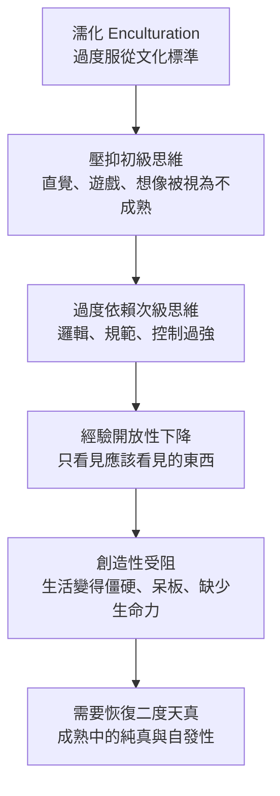

# 《動機與人格》第十三章：自我實現者的創造性

> 來源：使用者提供之《Motivation and Personality》第十三章〈自我實現者的創造性〉Notion 初整理。  
> 用途：補強星盤與星骰中的「創造性、自我實現、經驗開放性、二度天真、初級／次級思維、二分法消解、高峰體驗」解讀。  
> 整理原則：本文為二次整理版本，避免逐字搬運原書內容，重點放在心理學概念與星盤／星骰應用。

---

## 一、本章核心重點

### 1. 創造性不只屬於藝術家或科學家

馬斯洛重新定義創造性。創造性不只是畫家、音樂家、科學家、作家才擁有的能力，也可以出現在日常生活中。

例如一個人能把家整理得有美感，或用溫柔而富智慧的方式面對每一位病人，這些都可以是創造性的展現。

創造性不是單純專業技能，而是一種生活態度與人格狀態。

### 2. 兩種創造性：特殊天賦與自我實現

馬斯洛區分兩種創造性：

```text
特殊天賦的創造性 = 依賴特定才能、技術、專業訓練
自我實現的創造性 = 發自人格本身，表現在日常生活與存在方式中
```

本章重點不是天才式創造，而是健康人格自然流露出的創造性。

### 3. 自我實現創造性的核心是知覺開放

自我實現者能比較直接地看見事物本來的樣子，不容易被概念、標籤、預期、習慣或刻板印象遮蔽。

這種能力像《國王的新衣》裡說出真相的小孩：不是因為懂得更多理論，而是比較能直接看見。

### 4. 創造性具有表現性

自我實現創造性常表現為更自由、更自然、更少壓抑的表達。

這種人比較不害怕被嘲笑，也比較願意讓自己的想法、衝動、感受與創意自然流動。

### 5. 二度天真：成熟中的純真

二度天真不是幼稚，而是成熟之後重新獲得孩童般的直接感知與自發性。

它結合了成人的複雜心智與孩子般的開放感，是自我實現創造性的重要特徵。

### 6. 自我實現者被未知吸引

一般人面對混亂、含糊、不確定時，容易感到焦慮或想立刻控制。

自我實現者則更能在未知中保持開放，甚至把未知視為刺激、探索與創造的入口。

這是普通因應心態與創造性心態的重要差異。

### 7. 自我實現者能消解二分法

在自我實現者身上，許多常見對立會被整合，例如：

```text
自私 / 無私
工作 / 遊戲
理性 / 感性
成熟 / 天真
控制 / 自發
個人 / 社會
```

他們不是用非黑即白的方式處理人生，而是能在更高層次上整合矛盾。

### 8. 高峰體驗與創造性密切相關

高峰體驗中，人的內部分裂會暫時統一。懷疑、控制、壓抑與過度自我意識會減弱，整個人進入較完整、自由、開放的狀態。

這正是創造性容易出現的心理條件。

### 9. 初級思維與次級思維需要整合

初級思維包含直覺、想像、夢、遊戲、詩意、象徵與自由聯想。次級思維包含邏輯、批判、分析、計畫與現實檢驗。

健康的創造性不是只靠幻想，也不是只靠邏輯，而是兩者能夠互相合作。

### 10. 創造性是健康基本人性的自然表現

自我實現的創造性像陽光一樣自然存在。它不一定需要外在目的、設計或意識控制，就能讓接觸到的事物生長、變美、變有生命力。

這種創造性是健康人格自然散發出來的影響力。

---

## 二、心理學概念

### 自我實現的創造性（SA Creativity）

**白話意思：** 不是特殊才華，而是一種活得真實、有表現力、有生命力的方式。

**跟需求、動機、人格的關係：** 自我實現創造性直接發自人格本身，源於自我接納、整合與成長動機。它不是被匱乏逼出來的成就，而是健康人格自然流露出的生命力。

**星盤／星骰應用：** 對應太陽、金星、木星、第五宮、第九宮。若星骰出現這些元素，可能代表重點不是「做出很厲害的作品」，而是讓生活本身變得更有創造性。

---

### 經驗開放性（Openness to Experience）

**白話意思：** 能直接感知現實，不被預設觀念、標籤、恐懼或刻板印象過度過濾。

**跟需求、動機、人格的關係：** 恐懼與匱乏感會關閉感知，使人只看見自己害怕或期待的東西。自我接納與安全感越高，越能對經驗保持開放，創造力也越容易流動。

**星盤／星骰應用：** 對應月亮、水星、木星、海王星、第三宮、第九宮、第十二宮。若問學習、創作或靈感，要看當事人是否真正開放經驗，而不是只想控制結果。

---

### 二度天真（Second Naiveté）

**白話意思：** 成熟的人重新獲得孩童般的直接感知與自發性，但不是幼稚，而是「複雜心智中的純真」。

**跟需求、動機、人格的關係：** 社會化與濡化常會壓抑自然感知。自我實現者能突破這種限制，重新連結本能的知覺能力，代表人格已經有較高程度的整合。

**星盤／星骰應用：** 對應月亮、太陽、金星、第五宮、海王星。若星骰出現第五宮、金星或海王星，可能提醒當事人需要恢復遊戲性、純真感與直接感受。

---

### 初級思維過程 vs 次級思維過程

**白話意思：** 初級思維是夢、直覺、想像、聯想與詩意；次級思維是邏輯、分析、計畫與批判。

**跟需求、動機、人格的關係：** 過度適應社會會讓人壓抑初級思維，變得僵硬、呆板、過度理性。健康創造性需要初級與次級思維整合，而不是互相排斥。

**星盤／星骰應用：** 初級思維對應月亮、海王星、雙魚、第十二宮；次級思維對應水星、土星、處女、摩羯、第六宮。若創作卡住，要看是直覺不足，還是結構不足。

---

### 二分法的消解（Transcendence of Dichotomies）

**白話意思：** 不陷入非此即彼，而能同時容納並整合看似矛盾的部分。

**跟需求、動機、人格的關係：** 人格發展較低層時，常需要二分法維持安全感。人格越成熟，越能容納複雜與矛盾，並把它們整合為更高層次的統一。

**星盤／星骰應用：** 對應冥王星、木星、海王星、第八宮、第九宮、第十二宮。若星骰顯示強烈衝突，可能不是要選邊，而是要進入更深層整合。

---

## 三、特殊天賦創造性 vs 自我實現創造性

| 面向 | 特殊天賦的創造性 | 自我實現的創造性 |
|---|---|---|
| 核心來源 | 專門才能與技術 | 健康人格與生命力 |
| 表現領域 | 藝術、科學、專業成果 | 日常生活、關係、工作方式 |
| 是否需要天賦 | 較需要 | 不一定 |
| 動機基礎 | 可能是成就或專業追求 | 多來自成長動機與表現行為 |
| 風險 | 技術強但人格未必整合 | 可能不被視為正式成就 |
| 占星對應 | 水星、金星、火星、十宮 | 太陽、金星、木星、五宮、九宮 |
| 星骰提醒 | 看能力與作品 | 看存在方式與生活創造力 |

---

## 四、初級思維 vs 次級思維對照表

| 面向 | 初級思維過程 | 次級思維過程 |
|---|---|---|
| 核心 | 直覺、想像、象徵 | 邏輯、分析、計畫 |
| 狀態 | 夢境、遊戲、詩意、聯想 | 現實檢驗、批判、結構 |
| 優點 | 帶來靈感與原創性 | 讓想法落地與成形 |
| 失衡 | 逃避、混亂、幻想 | 僵硬、控制、缺乏靈感 |
| 占星對應 | 月亮、海王星、雙魚、十二宮 | 水星、土星、處女、摩羯、六宮 |
| 創作提醒 | 允許靈感流動 | 建立形式與執行步驟 |

---

## 五、濡化對創造性的壓抑機制



---

## 六、高峰體驗與創造性的關聯

高峰體驗能暫時整合內部分裂，使人更接近自我實現的創造性狀態。

```text
控制減弱
懷疑減弱
自我意識減弱
直覺與感受打開
整個人更完整地運作
創造性更容易自然流出
```

占星上可對應：

```text
木星 = 擴展、意義、成長
海王星 = 合一、神祕、想像
太陽 = 生命力與核心自我
第五宮 = 創作、遊戲、表現
第九宮 = 願景、哲學、遠方
第十二宮 = 潛意識、靈感、無我
```

---

## 七、二分法消解的自我評量問題

可用於星盤、星骰或個人成長分析：

```text
我能同時接納自己的自私與無私嗎？
我能把工作也變成遊戲嗎？
我能在理性中保留感性嗎？
我能在感性中保留現實感嗎？
我能成熟，同時不失去天真嗎？
我能控制行動，同時保留自發性嗎？
我能看見矛盾，而不急著選邊嗎？
我能讓不同部分一起合作，而不是互相否定嗎？
```

---

## 八、可用在星盤與星骰的地方

### 月亮：二度天真與感受流動

月亮對應感受、記憶、安全與本能反應。月亮受損時，人容易失去感知的純真，進入防衛與過度保護。月亮健康時，情緒能自然流動，也更接近二度天真的基礎。

### 金星：把生活活成藝術

金星不只代表外在美，也代表欣賞、品味、關係與生活美學。自我實現的金星，是把生活本身活成一件有生命力的作品。

### 火星：表現性與自發行動

火星對應衝動、行動與表達。若火星被過度壓抑，創造力與行動力都會受阻；健康火星能讓想法自然化為行動。

### 木星：成長與原創

木星最直接對應本章核心：從匱乏到成長，從模仿到原創，從封閉到開放。木星強時，要看創造性是否指向更大的生命意義。

### 土星：次級思維與過度控制

土星對應結構、規範、計畫與次級思維。健康土星能讓創意成形；失衡土星則可能過度控制，使直覺與創意窒息。

### 海王星：初級思維與詩意想像

海王星對應夢、直覺、詩意、神祕與象徵。健康海王星能帶來靈感；失衡海王星則可能陷入逃避幻想，需要土星或水星協助落地。

### 冥王星：二分法消解與深層整合

冥王星對應非黑即白的控制感、深層矛盾與轉化。它的創造性來自願意穿越矛盾，讓人格更深層地整合。

---

## 九、星骰創造性心理分析模板

```text
1. 這個問題是在談特殊才能，還是生活中的自我實現創造性？
2. 當事人目前是否對經驗保持開放？
3. 創作卡住是因為初級思維被壓抑，還是次級思維不足？
4. 這個人是否過度害怕未知與不確定？
5. 是否需要恢復二度天真、遊戲性與直接感受？
6. 土星是在幫創意成形，還是在壓死創意？
7. 海王星是在帶來靈感，還是在逃避現實？
8. 冥王星是否顯示深層矛盾需要整合，而不是選邊？
9. 這個創造性是匱乏成就，還是成長表現？
```

---

## 十、塔羅與六爻延伸

### 塔羅對應可能

```text
愚者 = 二度天真、自發性、開放未知
女祭司 = 初級思維、直覺、潛意識圖像
魔術師 = 將靈感轉為具體創造
皇帝 = 次級思維、結構、形式、落地
星星 = 靈感、高峰體驗、清新感受
太陽 = 自我實現創造性與生命力
世界 = 二分法整合與完整性
```

### 六爻延伸可能

```text
子孫爻旺 = 創造力、遊戲性、愉悅表達
父母爻旺 = 知識、形式、規範、技術支持
父母爻過旺剋子孫 = 結構壓制創造性
子孫爻受剋 = 表達、遊戲、創意受阻
世爻受合太過 = 被濡化或被環境標準吸附
世爻旺而通關 = 主體能整合矛盾並創造新路
```

---

## 十一、前十三章閱讀路徑

| 章節 | 核心問題 | 星盤／星骰用途 |
|---|---|---|
| 導論 | 人為什麼會想要？ | 看動機本質、無意識、多重動機 |
| 第二章 | 人的需求如何分層？ | 判斷問題屬於哪一層需求 |
| 第三章 | 需求滿足後會如何改變人？ | 看人格健康、自我實現、後設病態 |
| 第四章 | 哪些需求接近天生本性？ | 看真自我、偽自我、文化壓抑 |
| 第五章 | 高階需求有什麼意義？ | 看成長價值、愛的認同、功能自主性 |
| 第六章 | 人是否可以不被匱乏推動？ | 看表現行為、自發性、後設需求 |
| 第七章 | 什麼會真正致病？ | 看威脅、剝奪、威脅性衝突 |
| 第八章 | 破壞性是本能嗎？ | 看憤怒、侵略性、需求受挫反應 |
| 第九章 | 治療為什麼有效？ | 看關係、需求滿足、療癒力 |
| 第十章 | 什麼是正常和健康？ | 看被動適應、固有人性、潛能展開 |
| 第十一章 | 自我實現的人是什麼樣子？ | 看成熟人格、自主、使命與高峰體驗 |
| 第十二章 | 自我實現者如何愛？ | 看 B-love、尊重、開放性與健康親密 |
| 第十三章 | 創造性從哪裡來？ | 看開放性、二度天真、思維整合與生活創造力 |

---

## 十二、後續二次加工重點

1. 建立「特殊天賦創造性 vs 自我實現創造性」心理占星模組。
2. 將初級思維與次級思維整合進水星、土星、海王星筆記。
3. 將濡化壓抑創造性的流程圖連結到第四章真自我與偽自我。
4. 將高峰體驗與創造性連結第十一章自我實現者特徵。
5. 將二分法消解整理成心理成熟度自我評估工具。
6. 補充創作星骰 SOP，用於藝術、設計、影片、寫作與神祕學創作問題。

---

## 十三、暫定使用原則

1. 創造性不只看作品，也看生活方式。
2. 不要把創造性限制在藝術或專業才能。
3. 土星不是創意敵人，健康土星能讓創意成形。
4. 海王星不是必然逃避，健康海王星能打開初級思維。
5. 水星與土星過強時，要檢查是否壓抑直覺與遊戲性。
6. 海王星過強時，要檢查是否缺乏次級思維與落地能力。
7. 星骰問創作卡住時，要先分辨是靈感不足、結構不足，還是害怕未知。
8. 二分法消解常是創造性的關鍵，不一定要立刻選邊。
