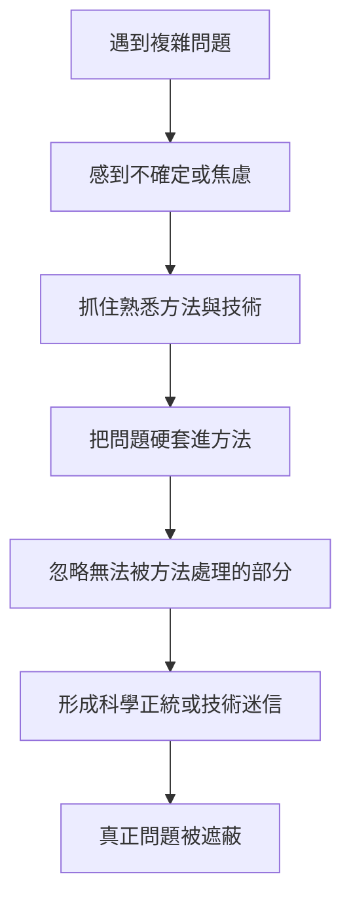
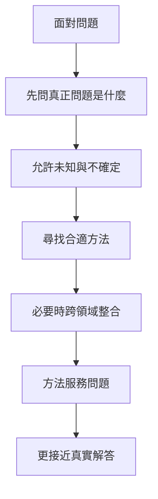

# 《動機與人格》第十六章：手段導向 vs. 問題導向

> 來源：使用者提供之《Motivation and Personality》第十六章〈手段導向 vs. 問題導向〉Notion 初整理。  
> 用途：補強星盤與星骰中的「手段導向、問題導向、科學正統、技術迷失、成長動機、研究方法與真正問題」解讀。  
> 整理原則：本文為二次整理版本，避免逐字搬運原書內容，重點放在心理學概念與星盤／星骰應用。

---

## 一、本章核心重點

### 1. 手段導向會把工具當成目的

手段導向者容易把方法、技術、儀器、流程或既有框架當成目的本身。

原本這些東西只是為了解決問題而存在，但手段導向會讓人忘記真正重要的是「問題是什麼」。

### 2. 問題導向先看真正要解決什麼

問題導向者在意的不是自己會什麼工具，而是這個問題到底是什麼、需要什麼方法、如何更接近真相或解法。

這種取向比較接近成長動機與自我實現者特質：不被習慣綁架，願意面對未知，並為問題尋找合適工具。

### 3. 手段導向容易削足適履

手段導向的科學家或研究者，可能把問題硬塞進自己熟悉的方法裡。

這會造成一種危險：不是方法服務問題，而是問題被迫服務方法。

### 4. 過度強調技術會削弱創造性

方法與技術當然重要，但若過度強調，就會讓科學失去意義、創造性與真正探索精神。

難以處理的問題常會被自我設限：因為手上沒有合適工具，就誤以為這個問題不該被問。

### 5. 手段導向會製造學科區隔

手段導向傾向維護各學科的既有邊界。問題導向則更可能跨領域合作，因為真正的問題通常不會乖乖待在單一學科裡。

這對心理學、占星、神祕學、AI 資料整理都很重要：真正的理解常需要跨系統整合。

### 6. 手段導向會限制科學的管轄範圍

當某一套方法被視為唯一合法方法，科學或知識系統就會排除許多尚無法用現有技術回答的問題。

這會讓非正統觀點長期被忽略，甚至被視為不值得研究。

### 7. 技術迷信會讓人誤以為自己更客觀

過度依賴方法與程序的人，可能以為自己比實際上更客觀。

但方法本身不能消除價值觀、動機、恐懼與偏見。若缺乏自我覺察，技術反而會變成掩飾主觀性的工具。

### 8. 手段導向容易形成科學正統

當某套方法長期佔據權威位置，就會形成科學正統。問題會被公式化、分類化、標準化，最後甚至把既有答案誤認為問題本身。

真正的探索精神會因此減弱。

### 9. 科學不只是規則與程序

科學不是單純遵守一套規則，也不只是像下棋、鍊金術或技術性治療那樣依照程序操作。

真正的科學必須保留對問題本身的敏感度、創造性、判斷力與意義感。

### 10. 無法被現有技術回答，不代表不該被問

手段導向最危險的地方，是讓人把「目前技術無法回答」誤認為「這個問題不重要」。

問題導向則提醒我們：有些重要問題需要等待新方法、跨領域合作或更成熟的理解方式。

---

## 二、心理學概念

### 手段導向（Means-Centered）

**白話意思：** 把「怎麼做」看得比「為什麼做」更重要，把工具、方法與技術當成目的本身。

**跟需求、動機、人格的關係：** 手段導向常反映安全感需求與防衛性動機。人用熟悉工具迴避陌生、深層或難以掌控的問題，藉此維持穩定感。

**星盤／星骰應用：** 對應土星、水星、處女、第六宮、第十宮。若星骰問學習、研究或工作，出現強土星或六宮時，要判斷這是在建立方法，還是在躲進方法裡。

---

### 問題導向（Problem-Centered）

**白話意思：** 先釐清真正的問題，再尋找合適的方法，而不是先套用自己熟悉的工具。

**跟需求、動機、人格的關係：** 問題導向對應成長動機與自我實現者特徵。它需要開放性、彈性、勇氣與面對未知的能力。

**星盤／星骰應用：** 對應木星、冥王星、太陽、第九宮、第十宮、第十一宮。若星骰出現木星或冥王星，可能提醒當事人要回到問題核心，而不是停在表面方法。

---

### 科學正統（Scientific Orthodoxy）

**白話意思：** 某套方法、框架或學派被視為唯一正確，其他觀點被排除或貶低。

**跟需求、動機、人格的關係：** 科學正統可能滿足群體歸屬與安全感需求，但也可能壓制創造性、跨領域探索與真實問題意識。

**星盤／星骰應用：** 對應土星、木星、第九宮、第十宮、第十一宮。若問題涉及學派、權威、標準或社群，要判斷它是在提供秩序，還是在壓制探索。

---

### 過度強調技術（Over-emphasis on Technique）

**白話意思：** 把精緻技術當成目標，忘記技術只是工具。

**跟需求、動機、人格的關係：** 這可能是匱乏性需求的表現：人用技術能力來補償面對深層問題的無力感，也用方法感來降低焦慮。

**星盤／星骰應用：** 對應水星、土星、處女、摩羯、第六宮。若星骰顯示方法細節過多，可能需要回問：真正要解決的核心問題是什麼？

---

## 三、手段導向 vs 問題導向對照表

| 面向 | 手段導向 | 問題導向 |
|---|---|---|
| 核心 | 方法、工具、技術 | 問題、真相、解法 |
| 動機 | 安全感、防衛、熟悉感 | 成長、探索、面對未知 |
| 常見風險 | 削足適履、技術迷信 | 問題過大、需要承受不確定 |
| 學科態度 | 維護邊界與正統 | 跨領域整合 |
| 對方法的態度 | 方法變成目的 | 方法服務問題 |
| 占星對應 | 土星、水星、處女、第六宮 | 木星、冥王星、第九宮、第十宮 |
| 星骰提醒 | 你是否躲進方法？ | 你是否看見核心問題？ |

---

## 四、手段導向的形成流程



---

## 五、問題導向的探索流程



---

## 六、可用在星盤與星骰的地方

### 月亮：熟悉反應與真實情緒核心

月亮容易用熟悉的情緒反應維持安全感。手段導向時，月亮可能反覆使用舊模式迴避真正情緒；問題導向時，月亮願意回到情緒核心。

### 金星：關係方法與真實愛

在關係中，手段導向可能表現為用討好、禮貌、技巧或固定模式維持和平，卻不真正表達愛與需求。問題導向則會問：這段關係真正缺的是什麼？

### 火星：直接行動與技術消耗

健康火星會直面目標與問題。若火星被手段導向消耗，可能變成一直準備、一直研究工具、一直訓練，卻不真正行動。

### 木星：跨領域視野與哲學追問

木星對應問題導向的廣闊視角。它會問大問題：這件事的意義是什麼？真正要解決的是什麼？還有沒有其他方法？

### 土星：規則、正統與技術框架

土星提供方法、規範與技術紀律，但失衡時會形成僵化正統，使人以規則取代探索。

### 海王星：用準備不足逃避真正問題

海王星有時會讓人用「我還沒準備好」「工具還不夠」「方法還不完美」來拖延面對真實問題。

### 冥王星：深層問題與正統控制

冥王星對應對深層問題的執著追求，也對應權威系統排除非主流觀點的控制面。若冥王星出現，要看是否有被壓下去的核心問題。

---

## 七、生活中的手段導向 vs 問題導向

| 情境 | 手段導向 | 問題導向 |
|---|---|---|
| 學習 | 一直找工具與課程 | 先問我要理解什麼 |
| 創作 | 一直研究軟體功能 | 先問我要表達什麼 |
| 感情 | 用技巧維持互動 | 先看真正需求與衝突 |
| 工作 | 只照流程做 | 先理解任務核心 |
| 占星 | 套公式解盤 | 先看個案真正問題 |
| 星骰 | 只背行星星座宮位 | 先釐清問題本意 |
| 易經 | 只驗證答案 | 先確認問卦本意 |
| 研究 | 套熟悉方法 | 依問題選方法 |

---

## 八、星骰研究與判斷補強模板

```text
1. 這個問題目前是手段導向，還是問題導向？
2. 當事人是否把工具、技術或流程當成目的？
3. 真正想解決的核心問題是什麼？
4. 目前的方法是否真的適合這個問題？
5. 是否因為沒有方法，就否定問題的重要性？
6. 是否需要跨領域整合？
7. 土星是在提供紀律，還是在形成僵化正統？
8. 木星是否能打開更大的問題視野？
9. 冥王星是否顯示有被壓抑的深層問題？
10. 這次解讀是否在套公式，還是真的回到個案核心？
```

---

## 九、與馬斯洛其他概念的連結

```text
B-cognition：問題導向更接近存有認知，看見問題本身。
D-needs：手段導向常與匱乏、安全感、防衛需求有關。
B-needs：問題導向更接近成長需求、自我實現與探索。
自我實現者特質：問題導向是自我實現者的重要特徵之一。
知覺污染：手段導向可能讓方法污染對問題的感知。
```

---

## 十、塔羅與六爻延伸

### 塔羅對應可能

```text
魔術師 = 技術、工具、方法；健康時能服務問題，失衡時迷失於手段
隱士 = 回到核心問題，追求真正理解
正義 = 方法、證據與判斷，但不能只剩程序
皇帝 = 結構、規範與正統
高塔 = 僵化方法被現實擊破
愚者 = 願意進入未知與新問題
世界 = 方法與問題整合完成
```

### 六爻延伸可能

```text
父母爻旺 = 方法、資料、工具、文本很強
父母爻過旺剋子孫 = 方法壓制創造與靈活性
用神不明 = 問題核心尚未釐清
用神受制 = 真正問題被方法或外在條件壓住
世爻執父母 = 當事人執著工具或資料
世爻得用神生扶 = 主體回到核心問題並獲得支持
```

---

## 十一、前十六章閱讀路徑

| 章節 | 核心問題 | 星盤／星骰用途 |
|---|---|---|
| 導論 | 人為什麼會想要？ | 看動機本質、無意識、多重動機 |
| 第二章 | 人的需求如何分層？ | 判斷問題屬於哪一層需求 |
| 第三章 | 需求滿足後會如何改變人？ | 看人格健康、自我實現、後設病態 |
| 第四章 | 哪些需求接近天生本性？ | 看真自我、偽自我、文化壓抑 |
| 第五章 | 高階需求有什麼意義？ | 看成長價值、愛的認同、功能自主性 |
| 第六章 | 人是否可以不被匱乏推動？ | 看表現行為、自發性、後設需求 |
| 第七章 | 什麼會真正致病？ | 看威脅、剝奪、威脅性衝突 |
| 第八章 | 破壞性是本能嗎？ | 看憤怒、侵略性、需求受挫反應 |
| 第九章 | 治療為什麼有效？ | 看關係、需求滿足、療癒力 |
| 第十章 | 什麼是正常和健康？ | 看被動適應、固有人性、潛能展開 |
| 第十一章 | 自我實現的人是什麼樣子？ | 看成熟人格、自主、使命與高峰體驗 |
| 第十二章 | 自我實現者如何愛？ | 看 B-love、尊重、開放性與健康親密 |
| 第十三章 | 創造性從哪裡來？ | 看開放性、二度天真、思維整合與生活創造力 |
| 第十四章 | 人本主義心理學還應研究什麼？ | 看健康視角、內在學習、正面情感與民主人格 |
| 第十五章 | 科學如何研究人？ | 看科學價值、知覺污染、研究者人格與客觀感知 |
| 第十六章 | 方法是否遮蔽了問題？ | 看手段導向、問題導向、技術迷失與真正問題 |

---

## 十二、後續二次加工重點

1. 建立「手段導向 vs 問題導向」概念卡片。
2. 將問題導向整合進星盤解讀 SOP。
3. 將「問卦本意」與問題導向連結，建立易經／六爻跨系統對照。
4. 建立「方法是否遮蔽問題」星骰檢核表。
5. 將本章與第十五章整合成「知識工作者與研究方法」主題模組。
6. 將手段導向加入土星、水星、處女座、第六宮解讀。
7. 將問題導向加入木星、冥王星、第九宮、第十宮解讀。

---

## 十三、暫定使用原則

1. 方法重要，但方法不是目的。
2. 若問題還沒釐清，不要急著套公式。
3. 星骰解讀時先確認問題本意，再套行星、星座、宮位。
4. 土星與水星強時，要檢查是否過度手段導向。
5. 木星與冥王星強時，要回到深層問題與大視野。
6. 若一直覺得工具不夠，可能是在逃避真正問題。
7. 真正成熟的研究者會讓方法服務問題，而不是讓問題服務方法。
