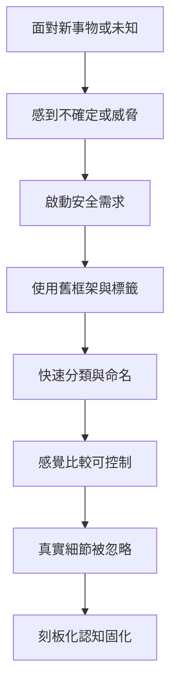
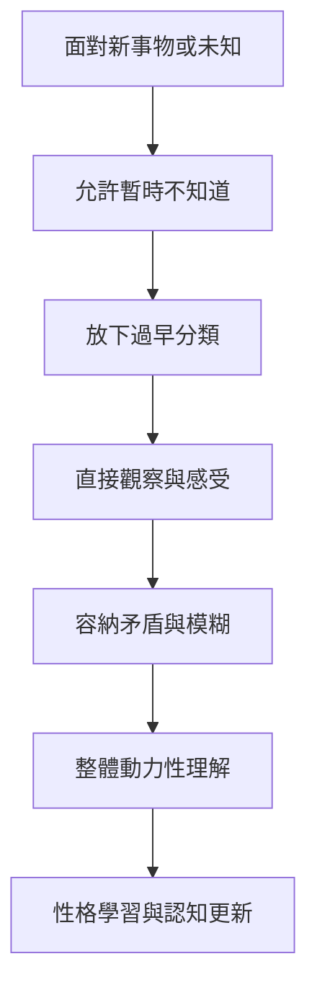

# 《動機與人格》第十七章：刻板化 vs. 真實認知

> 來源：使用者提供之《Motivation and Personality》第十七章〈刻板化 vs. 真實認知〉Notion 初整理。  
> 用途：補強星盤與星骰中的「刻板化、真實認知、範疇化注意力、性格學習、整體動力性思考、B-cognition」解讀。  
> 整理原則：本文為二次整理版本，避免逐字搬運原書內容，重點放在心理學概念與星盤／星骰應用。

---

## 一、本章核心重點

### 1. 刻板化是面對複雜世界的生存機制

刻板化認知可以幫人快速分類、節省精力，讓世界變得比較可預測。

但它的代價是：人可能把眼前新事物硬塞進舊框架，失去對當下事物本身的真實感知。

### 2. 刻板化有典型表現

刻板化常讓事物變成：

```text
熟悉而不新奇
圖式化而不鮮活
有名字而不再被真正感受
有組織而不再開放
有意義而不允許未知
俗套而不特別
預期內而不驚奇
```

這些特徵讓人更容易掌控世界，但也讓人更難真正看見世界。

### 3. 範疇化注意力是緊急機制

範疇化注意力只關心最基本分類，例如：

```text
安全或危險
自己人或外人
有用或沒用
可控制或不可控制
```

這在危急時有用，但如果長期主導認知，人就會失去細緻感受與開放理解。

### 4. 真實認知與刻板化相對

真實認知指的是放下標籤、框架與預設，直接看見眼前的人、事、物。

藝術家常能保留這種直接知覺；而科學家若過度依賴方法與技術，也可能反而失去直覺與真實感知。

### 5. 學習分為複製式學習與性格學習

複製式學習是把過去經驗套用到現在，快速但容易僵化。

性格學習則會改變整個人，使人的思考方式、感受方式與應對方式都發生轉變。它比較困難，但影響更深遠。

### 6. 習慣既必要也危險

習慣能幫助人適應生活，避免每件事都重新思考。

但習慣也可能讓人面對新問題時仍使用舊方法，導致真正問題被忽略。習慣一旦變成唯一反應，就會阻礙成長。

### 7. 語言本身也會刻板化

命名讓事物容易被溝通與分類，但也會讓事物失去獨特性。

當人一旦說「這就是某種類型」，就可能停止真正感受它。然而語言又是思想與交流的重要橋梁，所以重點不是拋棄語言，而是知道語言的限制。

### 8. 思考也有刻板化與整體動力性兩種方向

刻板化思考常表現為合理化、記憶扭曲、過早下結論與套用舊答案。

整體動力性思考則願意讓問題保持開放，觀察它的整體結構與內在動力，而不是急著用舊框架封住它。

### 9. 刻板化的核心常是對未知的恐懼

刻板化傾向強的人，通常不容易忍受未知、模糊與開放狀態。

因此，他們會提早鎖定結論，好讓世界看起來安全、清楚、可控制。

### 10. 刻板化有利有弊，關鍵是能否放下

刻板化不是完全壞，它能幫人節省精力、迅速判斷與維持秩序。

真正的問題是：人在需要真實認知時，能不能暫時放下刻板化，重新看見眼前事物本身。

---

## 二、心理學概念

### 刻板化（Stereotyping）

**白話意思：** 把眼前的人、事、物快速歸類，用已知框架理解，而不真正看見它。

**跟需求、動機、人格的關係：** 刻板化常來自安全感需求。越缺乏安全感，人越傾向使用標籤與舊框架。人格越成熟，越能在必要時放下標籤，回到真實認知。

**星盤／星骰應用：** 對應月亮、土星、水星、處女、摩羯。若星骰出現這些元素，要檢查當事人是否正在用熟悉框架保護自己，而不是看見真實問題。

---

### 範疇化注意力（Categorizing Attention）

**白話意思：** 注意力只聚焦在「這是威脅嗎」「這是哪一類」，而不是「它真正是什麼」。

**跟需求、動機、人格的關係：** 這是匱乏性動機的典型表現。當基本需求未被滿足，注意力會被危險偵測綁架，感知變得狹窄。

**星盤／星骰應用：** 對應月亮、火星、土星、第六宮、第八宮。若問題中有強烈防衛或危機感，要判斷當事人是否只在尋找危險，而不是理解整體。

---

### 真實認知（Authentic Perception）

**白話意思：** 放下標籤與舊框架，真正看見眼前這個獨特的人或事物。

**跟需求、動機、人格的關係：** 真實認知接近 B-cognition。它不是把事物工具化，而是能直接感知事物本身，是自我實現者的重要特徵。

**星盤／星骰應用：** 對應金星、木星、海王星、太陽、第九宮、第十二宮。若星骰出現金星或海王星，要分辨是存有式欣賞，還是理想化與投射。

---

### 性格學習（Character Learning）

**白話意思：** 不只是學會技巧或答案，而是整個人的思考方式、感受方式與應對方式被改變。

**跟需求、動機、人格的關係：** 性格學習對應成長性需求。它代表真正的學習不只是行為表面改變，而是人格與認知結構被重新組織。

**星盤／星骰應用：** 對應木星、土星、冥王星、第九宮、第十宮。若星骰問學習或成長，要看這只是複製答案，還是整個人正在被改變。

---

### 整體動力性思考（Holistic-Dynamic Thinking）

**白話意思：** 面對問題時，不急著套用既有答案，而是保持開放，讓問題本身逐漸顯示它的結構與本質。

**跟需求、動機、人格的關係：** 這是問題導向的思考版本，屬於成熟人格的認知方式。刻板化思考則更接近防禦性人格，用舊答案抵抗未知。

**星盤／星骰應用：** 對應木星、冥王星、海王星、第八宮、第九宮、第十二宮。若問題複雜，不一定要立刻分類，可能需要整體觀察。

---

## 三、刻板化 vs 真實認知對照表

| 面向 | 刻板化認知 | 真實認知 |
|---|---|---|
| 核心 | 快速分類 | 直接看見 |
| 動機 | 安全感、防衛、節省精力 | 開放、欣賞、成長 |
| 對未知 | 害怕、想控制 | 好奇、能停留 |
| 對語言 | 名稱取代體驗 | 知道語言有限 |
| 學習方式 | 複製舊經驗 | 性格學習與轉化 |
| 思考方式 | 套答案、合理化 | 整體動力性思考 |
| 占星對應 | 月亮受傷、土星過強、水星僵化 | 木星、金星、海王星高層、太陽 |
| 星骰提醒 | 你是否太快下分類？ | 你是否真正看見此事？ |

---

## 四、刻板化形成流程



---

## 五、真實認知形成流程



---

## 六、複製式學習 vs 性格學習

| 面向 | 複製式學習 | 性格學習 |
|---|---|---|
| 核心 | 套用過去答案 | 整個人被改變 |
| 速度 | 較快 | 較慢 |
| 深度 | 表層行為 | 人格與認知結構 |
| 適用 | 熟悉問題 | 新問題、人生課題 |
| 風險 | 僵化、反覆舊模式 | 需要承受不確定 |
| 占星對應 | 水星、土星、六宮 | 木星、冥王星、九宮 |
| 星骰提醒 | 這是在背答案嗎？ | 這是否改變了你？ |

---

## 七、可用在星盤與星骰的地方

### 月亮：熟悉感與防衛性分類

月亮會用熟悉感保護自己。若安全感不足，月亮容易把新經驗快速歸類為安全或危險，導致真實認知困難。

### 金星：愛的刻板化

金星失衡時，可能用類型、條件或理想模板選人，而不是真正感受對方。健康金星能欣賞對方的獨特性。

### 火星：舊行動模式與新衝動

火星若被習慣卡住，會一直用舊方法行動。健康火星能在新情境中產生真正的新衝動，而不是只重複舊反應。

### 木星：性格學習與開放視野

木星對應哲學成長、學習與視野擴張。健康木星能讓人放下舊分類，進入性格學習；失衡木星則可能變成膨脹僵化的信念系統。

### 土星：範疇化注意力與習慣

土星提供結構與規則，但過度土星化時，人會用結構逃避未知。範疇化注意力常與土星式控制需求有關。

### 海王星：語言之外的感知

海王星對應語言難以捕捉的體驗、神祕感、直覺與象徵。刻板化會讓海王星的感受力鈍化；但海王星失衡也可能造成模糊與投射。

### 冥王星：對未知的恐懼與看穿本質

冥王星的控制面會害怕未知，因此容易提前鎖死結論。轉化後的冥王星則能看穿表面分類，進入事物深層本質。

---

## 八、刻板化程度自我評估表

可用於星盤、星骰、學習與人際分析：

```text
我是否太快把人分類？
我是否用過去經驗直接判斷現在？
我是否害怕問題保持開放？
我是否把命名當成理解？
我是否只注意安全或危險，而忽略細節？
我是否很難接受預期之外的事？
我是否常用舊方法解決新問題？
我是否能在不知道答案時保持冷靜？
我是否願意讓新經驗改變我的看法？
```

---

## 九、與第十六章的連結

第十六章談手段導向 vs 問題導向。第十七章則把這個主題延伸到認知層面：

```text
手段導向 = 在方法上刻板化
刻板化認知 = 在感知上手段導向
問題導向 = 回到真正問題
真實認知 = 回到眼前事物本身
```

兩章可合併為一組主題：

```text
防禦性思維 vs 成長性思維
套公式 vs 看見問題
分類世界 vs 感知世界
安全感驅動 vs 成長動機驅動
```

---

## 十、塔羅與六爻延伸

### 塔羅對應可能

```text
愚者 = 開放未知、真實認知、願意重新開始
皇帝 = 結構與分類，失衡時過度刻板化
女祭司 = 語言之外的直覺感知
寶劍八 = 被舊框架困住，看不見新可能
月亮 = 投射、模糊與未知恐懼
星星 = 開放感知與信任未來
世界 = 整體動力性理解與整合
```

### 六爻延伸可能

```text
父母爻旺 = 概念、語言、分類、既有知識很強
父母爻過旺剋子孫 = 知識框架壓抑直覺與創造
官鬼爻旺 = 威脅感強，容易範疇化注意力
世爻受合太過 = 被舊框架或群體觀念吸住
用神不明 = 真正問題尚未被看見
用神得生 = 逐漸看見核心本質
子孫爻旺 = 開放、遊戲性、直接感受恢復
```

---

## 十一、前十七章閱讀路徑

| 章節 | 核心問題 | 星盤／星骰用途 |
|---|---|---|
| 導論 | 人為什麼會想要？ | 看動機本質、無意識、多重動機 |
| 第二章 | 人的需求如何分層？ | 判斷問題屬於哪一層需求 |
| 第三章 | 需求滿足後會如何改變人？ | 看人格健康、自我實現、後設病態 |
| 第四章 | 哪些需求接近天生本性？ | 看真自我、偽自我、文化壓抑 |
| 第五章 | 高階需求有什麼意義？ | 看成長價值、愛的認同、功能自主性 |
| 第六章 | 人是否可以不被匱乏推動？ | 看表現行為、自發性、後設需求 |
| 第七章 | 什麼會真正致病？ | 看威脅、剝奪、威脅性衝突 |
| 第八章 | 破壞性是本能嗎？ | 看憤怒、侵略性、需求受挫反應 |
| 第九章 | 治療為什麼有效？ | 看關係、需求滿足、療癒力 |
| 第十章 | 什麼是正常和健康？ | 看被動適應、固有人性、潛能展開 |
| 第十一章 | 自我實現的人是什麼樣子？ | 看成熟人格、自主、使命與高峰體驗 |
| 第十二章 | 自我實現者如何愛？ | 看 B-love、尊重、開放性與健康親密 |
| 第十三章 | 創造性從哪裡來？ | 看開放性、二度天真、思維整合與生活創造力 |
| 第十四章 | 人本主義心理學還應研究什麼？ | 看健康視角、內在學習、正面情感與民主人格 |
| 第十五章 | 科學如何研究人？ | 看科學價值、知覺污染、研究者人格與客觀感知 |
| 第十六章 | 方法是否遮蔽了問題？ | 看手段導向、問題導向、技術迷失與真正問題 |
| 第十七章 | 我是否真正看見事物？ | 看刻板化、真實認知、性格學習與開放感知 |

---

## 十二、後續二次加工重點

1. 建立「刻板化 vs 真實認知」概念卡片。
2. 將第十六、十七章整合成「防禦性思維 vs 成長性思維」主題頁。
3. 將刻板化程度自我評估表連結到月亮、土星、水星與第六宮解讀。
4. 將真實認知與 B-cognition 連結到金星、木星、海王星與第九宮／第十二宮。
5. 建立「馬斯洛認知理論 × 星盤應用」主題模組。
6. 補充塔羅「愚者 vs 皇帝」作為開放未知與過度結構化的對照。

---

## 十三、暫定使用原則

1. 標籤能幫助理解，但不能取代真實感知。
2. 星骰解讀時，不要只套行星、星座、宮位公式，要回到眼前問題本身。
3. 月亮與土星強時，要檢查是否因安全感需求而過度分類。
4. 水星強時，要檢查命名是否取代了理解。
5. 木星強時，要看是否能進入真正性格學習，而不是信念膨脹。
6. 海王星強時，要分辨真實直覺與投射幻想。
7. 冥王星強時，要檢查對未知的恐懼是否讓結論過早鎖死。
8. 成熟的認知不是沒有框架，而是能在需要時放下框架。
