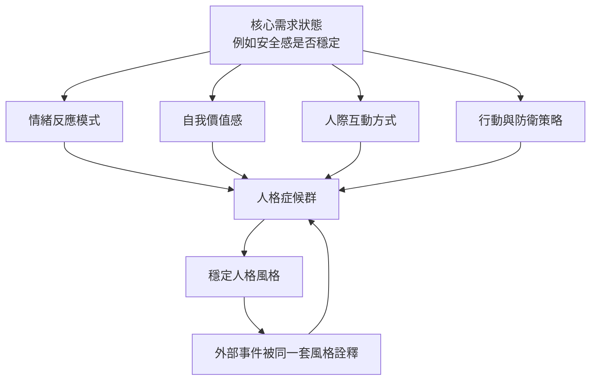
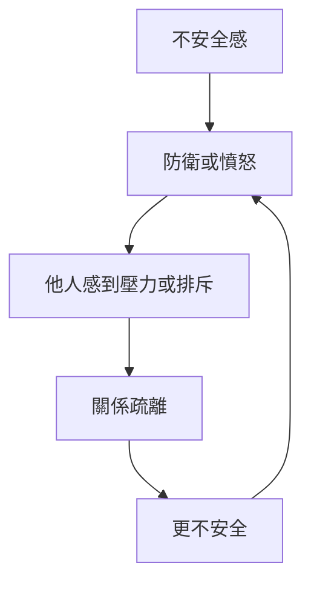

# 《動機與人格》第十八章：心理學的整體動力論

> 來源：使用者提供之《Motivation and Personality》第十八章〈心理學的整體動力論〉Notion 初整理。  
> 用途：補強星盤與星骰中的「整體動力論、人格症候群、因果循環、安全感症候群、整體分析法、人格系統改變」解讀。  
> 整理原則：本文為二次整理版本，避免逐字搬運原書內容，重點放在心理學概念與星盤／星骰應用。

---

## 一、本章核心重點

### 1. 人不能只被拆成零件研究

整體動力論的核心是：人不是一堆孤立零件的總和。

一個行為、症狀、反應或情緒，都必須放回整個人的生命脈絡、人格結構、需求狀態與環境關係中，才真正有意義。

### 2. 心理學的基本材料是有機體

心理學研究的基本單位不是肌肉收縮、反射動作或單一可觀察行為，而是整個有機體。

若只研究零碎反應，很容易把人簡化成機械系統，忽略整體人格如何組織、感受、選擇與行動。

### 3. 人格症候群是整體動力論的核心概念

人格中的特質不是各自獨立，而是彼此關聯、互相影響、共同出現。

例如安全感、自尊、樂觀、支配性、信任感可能形成一組人格叢聚。改變其中一部分，往往會牽動整個系統。

### 4. 因果循環使病態難以單點解決

心理病態常不是單一原因造成，而是循環結構。

例如：

```text
不安全感 → 憤怒 → 他人排斥 → 更不安全 → 更憤怒
```

這種循環難以只靠單一事件或單一建議打破，需要整體人格與關係系統的改變。

### 5. 安全感症候群是重要案例

馬斯洛以安全感症候群作為研究案例，指出安全感、自尊、支配性等特質具有相關性，且在不同文化中也可觀察到某些一致性。

這表示安全感不是單一感覺，而是一整套人格傾向的核心。

### 6. 自尊與安全感不同但常互相影響

自尊和安全感常一起出現，但不是同一件事。

一個人可能高自尊但低安全感，例如有能力、有成就，但內在仍恐懼、不安。也可能低自尊但有安全感，例如謙遜、不強勢，但內在穩定。

### 7. 文化影響表現形式，但不一定改變核心結構

人格症候群的外在表現會受到文化影響。不同文化可能用不同方式表達安全、尊嚴、支配、羞恥或依附。

但底層動力結構仍可能具有普遍性，因此跨文化比較可以幫助我們分辨核心需求與文化包裝。

### 8. 人格症候群有抗拒改變的傾向

無論安全感高或低，人格系統都會維持一定穩定性。外部刺激很難只改變單一症狀。

但如果整體人格結構真正改變，許多症狀與反應模式通常也會一起變動。

### 9. 整體分析法整合整體與分析

馬斯洛不是反對分析，而是反對只做原子式分析。

整體分析法主張：

```text
既要看整個人
也要分析各部分
再把各部分放回整體中理解
```

整體與分析不是對立，而是互補。

### 10. 人格資料難以用傳統邏輯完全切割

有機體中的各部分會重疊、互相包含、彼此影響。傳統原子式邏輯很難乾淨處理這種關係。

人格不是簡單的 A 或非 A，而更像一個互相牽連、層層嵌套的動態系統。

---

## 二、心理學概念

### 人格症候群（Personality Syndrome）

**白話意思：** 人格中的各種特質不是單獨存在，而是像一組互相影響的叢集，共同形成一個人的整體風格。

**跟需求、動機、人格的關係：** 這是整體動力論的核心。動機不是單一衝動，而是整個人格系統的表現。當某個核心需求改變，整個系統都可能跟著震動。

**星盤／星骰應用：** 對應整張命盤的綜合分析，而不是只看單一行星。若反覆出現月亮、土星、冥王星、四宮、八宮，可能不是單一事件，而是整體安全感症候群在運作。

---

### 因果循環（Circular Causation）

**白話意思：** 原因和結果互相製造，形成難以打破的循環。

**跟需求、動機、人格的關係：** 匱乏需求常會形成循環。人因不安全而防衛，防衛又讓關係更差，關係更差又加深不安全。這解釋了為什麼單一建議常無法真正改變深層問題。

**星盤／星骰應用：** 對應月亮、土星、冥王星、第八宮、第十二宮。星骰若顯示強烈重複模式，要檢查是否是因果循環，而不是單一事件。

---

### 安全感症候群（Security Syndrome）

**白話意思：** 安全感、自尊、信任、樂觀、支配性或穩定性等特質會互相關聯，形成一整套人格傾向。

**跟需求、動機、人格的關係：** 安全感不是單純「不害怕」，而是一個人格系統的中心。安全感穩定時，人比較能信任、開放、成長；安全感缺乏時，許多層面都可能受影響。

**星盤／星骰應用：** 對應月亮、金牛、巨蟹、第二宮、第四宮、土星。若星骰問感情、財務、家庭或工作安全感，可用此概念判斷是否牽涉整體人格狀態。

---

### 可互換性（Transposability）

**白話意思：** 同一個需求或動機可以透過不同表現形式達成，就像同一首曲子可以換調演奏，但旋律仍相同。

**跟需求、動機、人格的關係：** 人追求的是目標，而不是固定行為。為了取得安全感，有人可能討好，有人可能控制，有人可能退縮，有人可能努力賺錢，行為不同但動機可能相同。

**星盤／星骰應用：** 對應行星、星座、宮位的組合變化。同一個安全需求可能透過月亮、土星、金星、二宮、四宮、八宮不同方式表達。

---

### 整體分析法（Holistic-Analytic Method）

**白話意思：** 既看整個人的整體風格，也分析各部分如何運作，並在兩者之間來回切換。

**跟需求、動機、人格的關係：** 複雜人格不能只靠單點分析，也不能只靠模糊直覺。需要先看整體，再看細節，再把細節放回整體中理解。

**星盤／星骰應用：** 對應完整命盤分析方法。解盤時不能只看某顆行星，也不能只看某個宮位，而要看整體主題、重複線索與核心需求。

---

## 三、人格症候群形成流程



---

## 四、因果循環示意圖



---

## 五、安全感症候群 × 星盤對照表

| 層面 | 安全感高時 | 安全感低時 | 占星對應 |
|---|---|---|---|
| 月亮 | 能被照顧，也能照顧自己 | 情緒防衛、退縮、依附 | 月亮、巨蟹、四宮 |
| 金星 | 愛中較能給予與接受 | 用控制、討好或依賴換愛 | 金星、天秤、二宮、七宮 |
| 火星 | 行動直接，有健康界線 | 憤怒、防衛、攻擊或無力 | 火星、牡羊、八宮 |
| 木星 | 開放、信任、能成長 | 視野收縮、悲觀、防衛性信念 | 木星、九宮 |
| 土星 | 穩定界線與成熟結構 | 固著、恐懼、抗拒改變 | 土星、摩羯、十宮 |
| 海王星 | 信任生命、靈性安頓 | 理想化安全來源、逃避現實 | 海王星、十二宮 |
| 冥王星 | 深層力量能轉化 | 控制、懷疑、恐懼循環 | 冥王星、天蠍、八宮 |

---

## 六、自尊與安全感的區分

| 類型 | 可能狀態 | 解讀提醒 |
|---|---|---|
| 高自尊＋高安全感 | 有能力，也穩定 | 較能成熟行動與信任他人 |
| 高自尊＋低安全感 | 有能力，但恐懼 | 可能成就高，內在卻緊繃防衛 |
| 低自尊＋高安全感 | 謙遜但穩定 | 不強勢，但情緒底層可能安定 |
| 低自尊＋低安全感 | 無力又不安 | 可能形成依附、防衛或退縮循環 |

星盤提醒：

```text
自尊可多看太陽、火星、十宮。
安全感可多看月亮、二宮、四宮、土星。
兩者同時受壓時，問題往往不是單點事件，而是人格系統需要重整。
```

---

## 七、與第十六、十七章的連結

第十六章、第十七章、第十八章可以形成「馬斯洛認知與方法論」主題群：

```text
第十六章：手段導向 vs 問題導向
核心：方法是否遮蔽真正問題

第十七章：刻板化 vs 真實認知
核心：分類是否遮蔽真實感知

第十八章：整體動力論
核心：單點分析是否遮蔽整體人格系統
```

三章共同提醒：

```text
不要只套方法
不要只貼標籤
不要只看單一症狀
要回到問題本身、經驗本身、整個人本身
```

---

## 八、可用在星盤與星骰的地方

### 月亮：安全感症候群核心

月亮是安全感、依附、照顧與被照顧的核心。若月亮受傷，許多行為可能只是安全感不足的不同表現。

### 金星：安全感與愛的交換模式

安全感高的人較能自然給予愛與接受愛。安全感低時，金星容易變成依賴、討好、控制或用關係換穩定。

### 火星：憤怒與防衛循環

火星在低安全感者身上容易變成防衛性攻擊。此時火星不是真正行動力，而是保護脆弱安全感的反應。

### 木星：整體成長與系統打開

當安全感提升，整個人格系統可能跟著打開，木星式的信任、視野、學習與成長會更容易發生。

### 土星：人格抗拒改變與固著結構

土星對應人格中的慣性、防衛結構與抗拒改變。土星也能提供穩定，但失衡時會讓因果循環長期固化。

### 海王星：人格風味與理想化安全感

人格症候群的整體風味有時難以言說，接近海王星式的模糊感。海王星也可能使人把安全感投射到宗教、靈性、伴侶或幻想上。

### 冥王星：深層循環與整體轉化

冥王星對應因果循環背後的深層控制、恐懼與無力感。真正打破循環，往往需要冥王星式的深層轉化，而不是表面修補。

---

## 九、星骰整體動力分析模板

```text
1. 這是單一事件，還是人格症候群的一部分？
2. 目前最核心的需求是什麼？安全、愛、自尊、控制，還是自我實現？
3. 這個行為是否只是同一個動機的另一種表現？
4. 是否存在因果循環？例如不安 → 防衛 → 關係惡化 → 更不安。
5. 如果只改一個行為，整體系統會不會把它拉回原狀？
6. 月亮與土星是否顯示安全感系統固著？
7. 冥王星是否顯示需要深層轉化，而不是表面調整？
8. 木星是否能提供新的整體視野，讓系統打開？
9. 解讀時是否同時看整體與細節？
```

---

## 十、塔羅與六爻延伸

### 塔羅對應可能

```text
月亮 = 安全感不穩、循環性恐懼、模糊防衛
惡魔 = 因果循環、依附、控制與難以打破的模式
命運之輪 = 循環結構，也可能是系統轉動的機會
節制 = 系統調和與整體平衡
高塔 = 打破舊症候群結構
世界 = 整體整合與系統完成
```

### 六爻延伸可能

```text
爻動則卦變 = 一部分動，整體結構也跟著變
用神受剋 = 核心需求受阻，牽動整局
忌神持世 = 問題力量佔據主體位置
世應循環相生相剋 = 關係中的因果循環
變卦 = 整體系統改變後的新狀態
```

---

## 十一、前十八章閱讀路徑

| 章節 | 核心問題 | 星盤／星骰用途 |
|---|---|---|
| 導論 | 人為什麼會想要？ | 看動機本質、無意識、多重動機 |
| 第二章 | 人的需求如何分層？ | 判斷問題屬於哪一層需求 |
| 第三章 | 需求滿足後會如何改變人？ | 看人格健康、自我實現、後設病態 |
| 第四章 | 哪些需求接近天生本性？ | 看真自我、偽自我、文化壓抑 |
| 第五章 | 高階需求有什麼意義？ | 看成長價值、愛的認同、功能自主性 |
| 第六章 | 人是否可以不被匱乏推動？ | 看表現行為、自發性、後設需求 |
| 第七章 | 什麼會真正致病？ | 看威脅、剝奪、威脅性衝突 |
| 第八章 | 破壞性是本能嗎？ | 看憤怒、侵略性、需求受挫反應 |
| 第九章 | 治療為什麼有效？ | 看關係、需求滿足、療癒力 |
| 第十章 | 什麼是正常和健康？ | 看被動適應、固有人性、潛能展開 |
| 第十一章 | 自我實現的人是什麼樣子？ | 看成熟人格、自主、使命與高峰體驗 |
| 第十二章 | 自我實現者如何愛？ | 看 B-love、尊重、開放性與健康親密 |
| 第十三章 | 創造性從哪裡來？ | 看開放性、二度天真、思維整合與生活創造力 |
| 第十四章 | 人本主義心理學還應研究什麼？ | 看健康視角、內在學習、正面情感與民主人格 |
| 第十五章 | 科學如何研究人？ | 看科學價值、知覺污染、研究者人格與客觀感知 |
| 第十六章 | 方法是否遮蔽了問題？ | 看手段導向、問題導向、技術迷失與真正問題 |
| 第十七章 | 我是否真正看見事物？ | 看刻板化、真實認知、性格學習與開放感知 |
| 第十八章 | 人格能否被單點拆解？ | 看整體動力論、人格症候群與因果循環 |

---

## 十二、後續二次加工重點

1. 建立「人格症候群」概念卡片。
2. 建立「安全感症候群 × 星盤」專題頁。
3. 將因果循環加入感情、人際、工作星骰 SOP。
4. 將第十六、十七、十八章整合成「馬斯洛方法論」主題頁。
5. 將整體分析法整理為星盤解讀基本原則：先看整體，再看細節，再回整體。
6. 與易經變卦邏輯建立跨系統對照：一爻動，整卦變；一部分改變，整個人格系統也可能重組。

---

## 十三、暫定使用原則

1. 不要把單一症狀直接當成全部問題。
2. 星骰或星盤解讀時，要先看此事是否屬於整體人格症候群。
3. 若問題反覆出現，優先檢查因果循環。
4. 月亮與土星強時，特別看安全感症候群。
5. 冥王星強時，看深層循環與轉化需求。
6. 木星強時，看是否能透過新視野打開整體系統。
7. 解讀順序建議：整體主題 → 核心需求 → 因果循環 → 具體行動。
