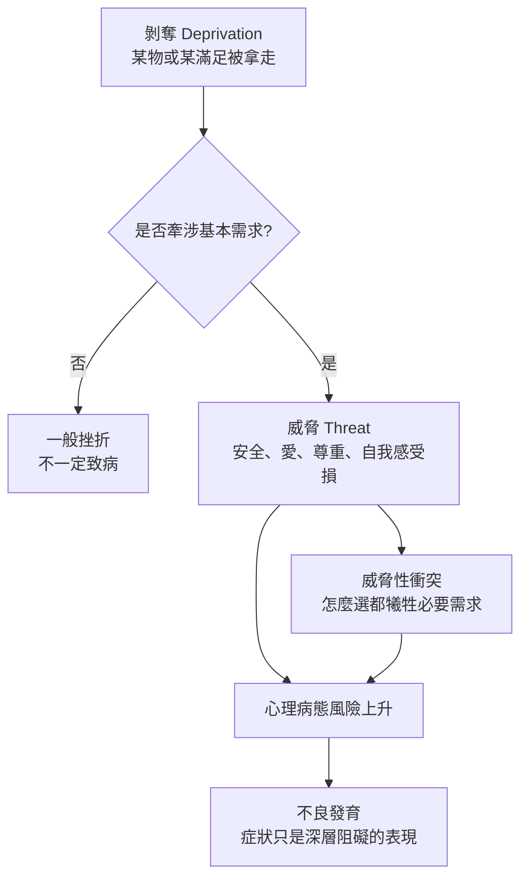

# 《動機與人格》第七章：病態的起源

> 來源：使用者提供之《動機與人格》第七章〈病態的起源〉Notion 初整理。  
> 頁碼：136–145。  
> 用途：補強星盤與星骰中的「挫折、剝奪、威脅、威脅性衝突、人本良心、自我實現受限」解讀。  
> 整理原則：本文為二次整理版本，避免逐字搬運原書內容，重點放在心理學概念與星盤／星骰應用。

---

## 一、本章核心重點

### 1. 心理病態要從挫折、剝奪與威脅三層來看

馬斯洛區分了三個層次：

```text
挫折 = 想要的路被阻擋
剝奪 = 某個目標物或滿足物被拿走
威脅 = 基本需求、自我感或未來成長被危害
```

其中真正具有致病力量的核心，不只是挫折或剝奪，而是「威脅」。

### 2. 剝奪不一定等於傷害

被拿走某樣東西，不一定會造成心理病態。關鍵在於這個東西對當事人代表什麼。

如果剝奪只是少了一個物品，可能不會造成深層傷害；但如果它象徵愛、尊重、價值感、歸屬或安全感被否定，就可能造成心理病態。

### 3. 目標物具有雙重意涵

一個目標物表面上可能是物質需求，例如食物、玩具、冰淇淋、金錢或關係。但在心理上，它也可能象徵地位、愛、被重視、尊重或價值感。

因此，解讀人的反應時不能只看外在事件本身，還要看這個事件在當事人內心代表什麼。

### 4. 衝突分成非威脅性與威脅性

有些衝突只是選擇路徑不同，目標本身沒有受到威脅，這類衝突通常不致病。

但有些衝突會迫使人放棄某個必要需求，例如在愛與安全、尊嚴與歸屬、成長與穩定之間做痛苦選擇。這種威脅性衝突才是真正危險的。

### 5. 威脅必須以主觀需求狀態來定義

同一件事對不同人可能有完全不同的心理影響。是否構成威脅，不能只靠外在情境客觀判斷，而要看當事人如何感受、如何詮釋，以及該事件觸發了哪一層基本需求。

這點對星盤與星骰很重要：同樣的土星限制、感情拒絕或職場挫折，對不同命盤的人可能造成不同程度的威脅。

### 6. 健康的人對威脅有較高免疫力

如果一個人內在已經有足夠的愛、安全感與自我價值，即使失去某些外在滿足，也比較不會被完全擊倒。

相反地，若基本需求長期不足，同樣的失去可能會被感受成整個自我被否定。

### 7. 自我實現受限也是一種威脅

威脅不只來自缺乏安全、愛或尊重，也可能來自成長被阻斷。能力無法使用、潛能被壓抑、力量被孤立、人生方向被切斷，都可能威脅自我實現。

對較成熟的人來說，後設需求與成長需求受阻，也會形成深層痛苦。

### 8. 心理病態可理解為不良發育

病態不是某個單一症狀，而是整個人格發展受到阻礙後的表現。焦慮、強迫、退縮、攻擊、依附、控制等症狀，可能只是更深層發育不良的不同外顯形式。

### 9. 人本良心是偏離成長道路的內在訊號

人本良心不是單純外在道德規則的內化，而是一種內在感知：當人偏離自己的成長、自我實現或真實潛能時，會感覺到不對勁。

這種不對勁本身也是一種威脅訊號。

### 10. 病態成因理論必須建立在動機理論上

要理解什麼會致病，必須先理解人真正需要什麼、追求什麼、害怕失去什麼。威脅的定義必然牽涉人的基本目標、價值與需求。

---

## 二、心理學概念

### 剝奪（Deprivation）

**白話意思：** 被拿走某樣東西，或得不到某種滿足。

**跟需求、動機、人格的關係：** 剝奪本身不一定造成心理病態。只有當剝奪同時象徵基本需求被否定，例如愛、尊重、安全感或價值感被剝奪時，才會造成深層傷害。

**星盤／星骰應用：** 對應月亮、金星、土星、第二宮、第四宮、第七宮。若星骰出現剝奪感，要先問：當事人失去的到底是物品、關係，還是背後的安全感與價值感？

---

### 威脅（Threat）

**白話意思：** 讓人感到基本需求、自我感、價值感或未來成長受到危害的主觀感受。

**跟需求、動機、人格的關係：** 威脅是心理病態的核心成因。它必須依照個人的主觀感受與需求狀態來定義，而不能只看外在環境。

**星盤／星骰應用：** 對應月亮、土星、冥王星、第八宮、第十二宮。當星骰出現這些元素時，要判斷當事人是否感到生存、安全、愛、自尊或成長受到威脅。

---

### 威脅性衝突（Threatening Conflict）

**白話意思：** 面臨兩個重要選項，無論選哪個都像是會失去某個必要需求。

**跟需求、動機、人格的關係：** 這類衝突會使基本需求長期受挫，因此容易致病。一般選擇衝突不一定會造成深層傷害，關鍵是選擇是否牽涉必要需求的犧牲。

**星盤／星骰應用：** 對應火星、土星、冥王星、天秤、天蠍、第七宮、第八宮。若當事人感到「怎麼選都會失去重要東西」，就是威脅性衝突的典型訊號。

---

### 目標物的雙重意涵

**白話意思：** 同一件事物表面上是物質或事件，內在可能象徵愛、尊重、地位、安全或價值。

**跟需求、動機、人格的關係：** 這說明為什麼同樣的剝奪對不同人會造成不同傷害。關鍵不在物品本身，而在它承載了什麼象徵意義。

**星盤／星骰應用：** 對應金星、月亮、第二宮、第七宮、第十宮。感情拒絕不一定只是失去對方，也可能象徵「我不值得被愛」；工作失敗不一定只是失去機會，也可能象徵「我沒有價值」。

---

### 人本良心（Humanistic Conscience）

**白話意思：** 當人偏離自己的成長、自我實現或真實潛能時，內在會感覺到不對勁。

**跟需求、動機、人格的關係：** 這不同於外在道德規範或超我，而是一種對自身成長方向的內在感知。人本良心會提醒一個人：自己是否正在遠離真正應該成為的樣子。

**星盤／星骰應用：** 對應太陽、木星、第九宮、第十宮、第十二宮。當星骰出現木星、太陽或九宮時，可以檢查：當事人是否偏離了自己的成長道路？

---

### 自我實現受限作為威脅

**白話意思：** 當人的能力無法使用、潛能無法發揮、成長被壓制時，這本身就是一種心理威脅。

**跟需求、動機、人格的關係：** 威脅不只來自匱乏，也來自成長受阻。對較成熟的人來說，無法實現自己，會像失去安全感或愛一樣痛苦。

**星盤／星骰應用：** 對應太陽、木星、土星、冥王星、第九宮、第十宮、第十一宮。若星骰顯示成長受阻，要把它視為真正的心理威脅，而不是單純暫時不順。

---

## 三、剝奪、挫折、威脅的遞進關係



---

## 四、致病條件對照表

| 情況 | 是否容易致病 | 判斷重點 |
|---|---|---|
| 一般願望受阻 | 不一定 | 只是想要沒得到，不等於基本需求受威脅 |
| 物品被拿走 | 不一定 | 要看物品是否象徵愛、尊重、地位或安全 |
| 愛、安全、尊重被否定 | 容易 | 基本需求受威脅，可能形成深層傷害 |
| 普通選擇困難 | 不一定 | 若只是路徑不同，目標未受威脅，通常不致病 |
| 威脅性衝突 | 容易 | 選任一方都會犧牲必要需求 |
| 自我實現受限 | 可能 | 成長、能力、潛能被阻斷也可能形成威脅 |
| 健康者短暫失去滿足 | 較不易 | 內在安全與價值感足夠，威脅免疫力較高 |
| 長期匱乏者再度失去 | 較易 | 可能被感受為整個自我再次被否定 |

---

## 五、可用在星盤與星骰的地方

### 月亮：剝奪的雙重意涵

月亮受損時，失去的不只是情緒滿足，也可能是「我不值得被愛」「我沒有安全感」「我不被照顧」的底層威脅。感情或家庭問題中，月亮常顯示剝奪背後的象徵意義。

### 金星：目標物的象徵性

金星代表愛、價值、吸引與被接納。被拒絕時，當事人失去的不一定只是某段關係，也可能是自我價值、尊重與被愛感。

### 火星：威脅性衝突中的行動受阻

火星受剋時，慾望與行動可能被阻礙。若當事人感到無論行動或不行動都會失去重要需求，就形成威脅性衝突。

### 木星：人本良心與成長道路

木星可對應成長、意義與應走的道路。當人偏離成長方向，木星式的不安可能不是普通焦慮，而是人本良心在提醒。

### 土星：限制不一定等於致病

土星代表限制、延遲與壓力，但限制本身不一定致病。關鍵在於當事人是否把限制詮釋為基本需求被否定，例如「我不值得」「我不安全」「我永遠不會成功」。

### 海王星：威脅感知的模糊性

海王星使威脅變得難以辨識。當事人可能理想化傷害來源，或分不清楚自己真正害怕的是失去對方、失去幻想，還是失去自我。

### 冥王星：災難性衝突與深層無力感

冥王星象徵深層、極端、不可逆的衝突。當人感到「無論怎麼選都會失去必要之物」，冥王星式的無力、控制、恐懼與重生議題就會被觸發。

---

## 六、星骰心理分析補強模板

```text
1. 這件事是一般挫折，還是基本需求受到威脅？
2. 當事人失去的是表面目標，還是背後的愛、尊重、安全或價值感？
3. 這個衝突是普通選擇，還是威脅性衝突？
4. 同樣的事件，對當事人來說象徵什麼？
5. 這件事是否讓當事人偏離自我實現道路？
6. 土星帶來的是可承受限制，還是被詮釋成自我否定？
7. 海王星是否讓威脅變得模糊或被理想化？
8. 冥王星是否顯示「怎麼選都會失去」的深層恐懼？
```

---

## 七、與第六章的連結

第六章談到表現行為、自我實現與後設需求。第七章進一步補上：

```text
如果一個人的自我實現被阻斷，這本身也會構成威脅。
如果一個人的能力被誤用、不被使用或被孤立，心理病態可能不只來自匱乏，也來自成長被阻止。
```

因此，星骰與星盤解讀不能只問「你缺少什麼」，也要問：

```text
你是否正在遠離自己真正能成為的人？
你是否把成長需求壓下去了？
你是否因為害怕威脅，而停止使用自己的能力？
```

---

## 八、塔羅與六爻延伸

### 塔羅對應可能

```text
月亮 = 模糊威脅感、恐懼投射、看不清真正危險
惡魔 = 災難性衝突、困縛、深層依附與控制
高塔 = 威脅爆發、舊結構崩塌
寶劍二 = 普通選擇或衝突，需要判斷是否威脅性
寶劍八 = 感到被困住，可能對應威脅性衝突
```

### 六爻延伸可能

```text
用神受剋 = 核心需求受阻
忌神持世 = 當事人被威脅感或阻礙力量佔據
世應相沖 = 主體與外界形成衝突
用神與忌神同時強 = 威脅性衝突，選擇可能意味著犧牲另一個需求
```

---

## 九、前七章閱讀路徑

| 章節 | 核心問題 | 星盤／星骰用途 |
|---|---|---|
| 導論 | 人為什麼會想要？ | 看動機本質、無意識、多重動機 |
| 第二章 | 人的需求如何分層？ | 判斷問題屬於哪一層需求 |
| 第三章 | 需求滿足後會如何改變人？ | 看人格健康、自我實現、後設病態 |
| 第四章 | 哪些需求接近天生本性？ | 看真自我、偽自我、文化壓抑 |
| 第五章 | 高階需求有什麼意義？ | 看成長價值、愛的認同、功能自主性 |
| 第六章 | 人是否可以不被匱乏推動？ | 看表現行為、自發性、後設需求 |
| 第七章 | 什麼會真正致病？ | 看威脅、剝奪、威脅性衝突 |

---

## 十、後續二次加工重點

1. 將「剝奪 → 挫折 → 威脅」整合進星骰心理層 SOP。
2. 建立「致病條件表」供感情、事業、家庭問題判斷使用。
3. 以土星相位為例，整理同樣限制如何因詮釋不同而致病或不致病。
4. 將人本良心與木星、太陽、第九宮、第十宮連結到人生方向分析。
5. 將威脅性衝突加入塔羅、六爻與星骰跨系統對照。

---

## 十一、暫定使用原則

1. 不要把所有挫折都判斷為心理創傷。
2. 先看剝奪是否觸及基本需求，再判斷是否具有致病性。
3. 土星限制不一定壞，要看當事人是否把限制詮釋為基本需求被否定。
4. 感情問題中的拒絕，常要看它是否象徵自我價值被否定。
5. 若星骰出現冥王星或八宮，要檢查是否有威脅性衝突或災難性選擇感。
6. 若問題涉及人生方向，要檢查自我實現是否受限。
