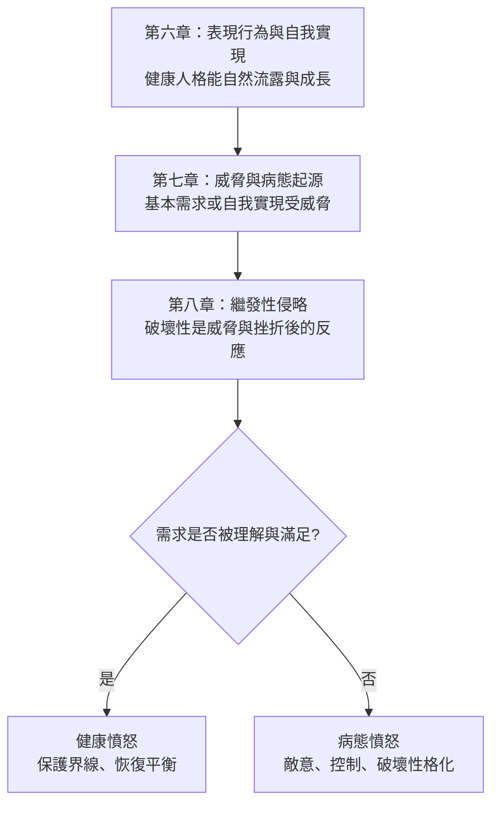

# 《動機與人格》第八章：破壞性是一種本能嗎？

> 來源：使用者提供之《動機與人格》第八章〈破壞性是一種本能嗎？〉Notion 初整理。  
> 頁碼：148–162。  
> 用途：補強星盤與星骰中的「侵略性、憤怒、破壞性、威脅反應、防衛性暴力、病態性暴力」解讀。  
> 整理原則：本文為二次整理版本，避免逐字搬運原書內容，重點放在心理學概念與星盤／星骰應用。

---

## 一、本章核心重點

### 1. 破壞性不是人類的根本本能

馬斯洛不把破壞性、侵略性視為人類天生的原始本能，而是將其理解為繼發性、衍生性的行為。

換句話說，攻擊和破壞多半不是最初的原因，而是需求受到威脅、挫折或剝奪後出現的反應。

### 2. 侵略性是多重因素決定的

動物研究顯示，侵略性會受到遺傳、地位、領域、配偶競爭、社會關係與環境壓力等多重因素影響。

越接近人類的動物，侵略性越不是單純本能，而更受社會條件與情境結構影響。

### 3. 兒童的破壞性多半是反應性的

兒童的破壞、敵意與攻擊，常在安全感、愛、尊重或關注受挫時出現。這並不代表孩子天生邪惡，而是需求受阻後的反應。

若孩子確信自己被愛、被看見、被照顧，同樣的挫折未必會引發強烈破壞性。

### 4. 人性在生物學層面並非本來就壞

人類的基本需求，例如食物、安全感、愛、歸屬、自我肯定，本身是中性甚至健康的。將原始需求直接視為邪惡，是對人性的誤解。

破壞性通常不是基本需求本身，而是基本需求被扭曲、壓抑或長期受挫後的結果。

### 5. 破壞性至少有三大決定因素

破壞性行為不能只用單一原因解釋，至少要看：

```text
性格結構
內在動機
文化壓力與直接情境
```

這表示星盤或星骰看到火星、冥王星、八宮時，也不能直接判定為「天生暴力」，而要看需求、環境、壓抑與威脅背景。

### 6. 暴力可以分成健康與不健康兩種

健康的暴力偏向防衛性，用來保護自己、保護界線、阻止侵犯，並且能被控制。

不健康的暴力則源自長期仇恨、敵意、需求受挫與人格化的攻擊模式，常帶有破壞衝動與控制欲。

### 7. 憤怒與破壞欲常潛伏在表象之下

臨床經驗顯示，人可能表面正常，底層卻壓抑大量憤怒、仇恨、攻擊性與破壞欲。

但這些東西通常不是人的本性，而是基本需求長期受挫、威脅累積、愛與安全未被滿足後的結果。

### 8. 文化會塑造侵略性

不同文化中侵略性的強度與表現差異很大，這說明破壞性不是固定不變的命運。

文化、教育、家庭與社會制度可以放大侵略，也可以減少侵略。

### 9. 生物因素有影響，但不是單一本能

荷爾蒙、內分泌與遺傳因素確實可能影響攻擊傾向，但它們不是唯一因素，也不能單獨解釋破壞性。

破壞性仍需要放進整個人格、文化、需求與情境系統中理解。

### 10. 暴力是人類本質的一部分，但不是不可避免的

人類確實具有保護、攻擊、防衛與反擊能力，但這不等於暴力必然會失控。

暴力是否發展成病態，取決於需求是否被長期挫折、環境是否促進敵意、文化是否鼓勵破壞，以及個體是否能健康整合憤怒。

---

## 二、心理學概念

### 繼發性侵略（Derived Aggression）

**白話意思：** 攻擊與破壞行為不是最原始的本能，而是基本需求被威脅、剝奪或挫折後產生的反應。

**跟需求、動機、人格的關係：** 這個概念反對把人類攻擊性簡化為死亡本能或天生惡性。要理解侵略性，必須先理解當事人的需求結構、挫折歷史與威脅感。

**星盤／星骰應用：** 對應火星、土星、冥王星、八宮。若星骰出現攻擊性組合，不要立刻判斷「此人壞」或「此事必然衝突」，要先看其背後是否有安全、愛、尊重或自我價值被威脅。

---

### 防衛性暴力 vs 病態性暴力

**白話意思：** 保護自己的憤怒不一定是不健康；但長期積累、失控、以破壞為目的的敵意，則屬於病態。

**跟需求、動機、人格的關係：** 健康人格能在必要時表達憤怒、保護界線，也能控制攻擊性。人格受損時，攻擊性可能固定成持續敵意、破壞衝動或控制慾。

**星盤／星骰應用：** 對應火星、土星、冥王星。火星健康時是防衛與行動，火星受壓且連結冥王星時，可能呈現深層敵意或破壞性累積。

---

### 地盤性（Territoriality）

**白話意思：** 人與動物都可能對自己的領域、資源、位置、地位或關係產生保護傾向，一旦被侵犯就容易觸發攻擊。

**跟需求、動機、人格的關係：** 地盤性不只是物理空間，也可能是心理空間、關係位置、自尊地位或安全界線。它與安全需求、自尊需求密切相關。

**星盤／星骰應用：** 對應金牛、天蠍、第二宮、第四宮、第八宮、火星。若問題涉及佔有、嫉妒、地位、資源或界線，可能觸發地盤性防衛。

---

### 兄弟競爭敵意（Sibling Rivalry）

**白話意思：** 手足之間爭奪父母的愛、關注、地位與資源，可能引發敵意與破壞性。

**跟需求、動機、人格的關係：** 核心不是孩子天生想攻擊手足，而是愛的剝奪感、被取代感與安全感受威脅。若孩子確信自己被愛，同樣的競爭未必產生強烈敵意。

**星盤／星骰應用：** 對應月亮、金星、第三宮、第四宮、第十一宮。手足、人際、朋友或同儕競爭問題中，要看當事人是否感到「我被取代」「我不再被愛」。

---

### 文化對侵略性的塑造

**白話意思：** 不同文化會放大或減少侵略性，因此破壞性不是固定不變的本能命運。

**跟需求、動機、人格的關係：** 需求雖然普遍，但滿足或剝奪需求的方式受到文化影響。文化若長期製造羞辱、競爭、壓抑與剝奪，侵略性就容易增加。

**星盤／星骰應用：** 對應木星、土星、第九宮、第十宮、第十一宮。木星可看文化信念與價值觀，土星可看制度與限制，十一宮可看群體壓力。

---

## 三、佛洛伊德 vs 馬斯洛：破壞性觀點對照

| 面向 | 佛洛伊德式觀點 | 馬斯洛式觀點 |
|---|---|---|
| 破壞性來源 | 可能來自死亡本能或深層攻擊本能 | 多半是需求受挫後的繼發反應 |
| 人性基調 | 需要控制原始衝動 | 基本需求本身中性或健康 |
| 攻擊性重點 | 內在本能衝突 | 威脅、剝奪、文化與人格結構 |
| 治療方向 | 管理衝動與潛意識衝突 | 滿足基本需求、恢復健康本性 |
| 星盤解讀提醒 | 火星／冥王星可能象徵衝突本能 | 先看需求受挫、威脅與壓抑背景 |

---

## 四、健康憤怒 vs 病態憤怒檢核表

### 健康憤怒

```text
是為了保護自己或他人
能清楚知道自己在生氣什麼
有界線，但不以摧毀對方為目的
可以被表達，也可以被控制
事件結束後能慢慢恢復
不會長期固定成敵意人格
```

### 病態憤怒

```text
長期累積但無法清楚說出原因
表面平靜，底層充滿敵意
以控制、報復、羞辱或摧毀為目的
反應遠大於事件本身
常伴隨深層無力感、羞辱感或被剝奪感
逐漸固定成性格模式
```

---

## 五、可用在星盤與星骰的地方

### 月亮：安全感剝奪與繼發性侵略

月亮受剋時出現的憤怒，常不是單純壞脾氣，而可能是長期未被照顧、未被安撫、未被理解後的防衛反應。

### 金星：愛的剝奪感與競爭敵意

金星受損時，可能不只是感情不順，也可能代表被愛、被選擇、被重視的需求受挫。兄弟競爭、人際嫉妒與感情敵意常可從此理解。

### 火星：防衛性暴力與病態性暴力的分水嶺

火星健康時，能保護界線、表達憤怒、採取行動。火星失衡時，可能表現為失控攻擊、長期敵意、衝動破壞或把所有關係都看成戰場。

### 木星：文化如何放大或縮小攻擊性

木星對應信念、文化、教育與社會價值。若文化鼓勵競爭、羞辱或支配，個人的火星與冥王星更容易被放大成侵略性。

### 土星：長期壓抑的需求與憤怒累積

土星可能代表需求長期受限、情緒被禁止、行動被壓抑。被壓太久的火星能量，可能轉成冷漠、怨恨或間接攻擊。

### 海王星：攻擊性的否認與模糊化

海王星會讓人看不清自己的憤怒，甚至把傷害包裝成犧牲、愛或理想。未被承認的憤怒容易在表象下累積。

### 冥王星：病態性暴力與深層敵意

冥王星對應那些人格化的敵意、控制欲、破壞衝動與深層報復。當它被強烈觸發時，要看是否有長期需求受挫與無力感背景。

---

## 六、第六章 → 第七章 → 第八章因果鏈



---

## 七、星骰心理分析補強模板

```text
1. 這個憤怒是防衛性，還是病態性？
2. 攻擊背後是哪一層需求被威脅？
3. 當事人是在保護界線，還是在報復或控制？
4. 這個反應是否遠大於事件本身？
5. 是否有長期愛、安全、尊重受挫的背景？
6. 火星是在健康行動，還是被土星壓抑後爆發？
7. 冥王星是否顯示深層敵意、羞辱感或無力感？
8. 海王星是否讓憤怒被否認、模糊或理想化？
9. 目前最健康的做法是表達界線，還是先承認被壓抑的需求？
```

---

## 八、塔羅與六爻延伸

### 塔羅對應可能

```text
寶劍五 = 衝突、羞辱、失敗感、繼發性侵略
力量 = 健康暴力的馴化與整合，能控制力量而不否認力量
戰車 = 防衛、行動與方向控制
惡魔 = 病態敵意、困縛、控制與破壞衝動
高塔 = 壓抑破裂後的爆發
```

### 六爻延伸可能

```text
官鬼爻旺 = 壓力、威脅、恐懼感強
世爻弱 = 主體界線不足，容易被威脅牽動
世爻強而受剋 = 防衛性反擊
忌神持世 = 憤怒或破壞性成為主體狀態
用神受剋且無救 = 核心需求長期受挫，可能引發病態反應
```

---

## 九、前八章閱讀路徑

| 章節 | 核心問題 | 星盤／星骰用途 |
|---|---|---|
| 導論 | 人為什麼會想要？ | 看動機本質、無意識、多重動機 |
| 第二章 | 人的需求如何分層？ | 判斷問題屬於哪一層需求 |
| 第三章 | 需求滿足後會如何改變人？ | 看人格健康、自我實現、後設病態 |
| 第四章 | 哪些需求接近天生本性？ | 看真自我、偽自我、文化壓抑 |
| 第五章 | 高階需求有什麼意義？ | 看成長價值、愛的認同、功能自主性 |
| 第六章 | 人是否可以不被匱乏推動？ | 看表現行為、自發性、後設需求 |
| 第七章 | 什麼會真正致病？ | 看威脅、剝奪、威脅性衝突 |
| 第八章 | 破壞性是本能嗎？ | 看憤怒、侵略性、需求受挫反應 |

---

## 十、後續二次加工重點

1. 將「繼發性侵略」整合進火星相位解讀。
2. 建立火星專用頁：防衛性火星、病態火星、壓抑火星、冥王星化火星。
3. 將第六章、第七章、第八章整理成完整因果鏈：表現行為 → 威脅 → 繼發性侵略。
4. 建立「健康憤怒 vs 病態憤怒」檢核清單，放入星骰 SOP。
5. 補充塔羅與六爻跨系統對照。

---

## 十一、暫定使用原則

1. 不要把火星、冥王星直接解成壞或暴力。
2. 憤怒可能是健康界線，也可能是長期威脅後的病態反應。
3. 解讀破壞性時，先問基本需求是否受挫，而不是先道德評價。
4. 海王星強時，要小心憤怒被否認或包裝成犧牲。
5. 土星強時，要檢查長期壓抑是否造成間接攻擊。
6. 冥王星強時，要檢查深層敵意是否已經人格化。
