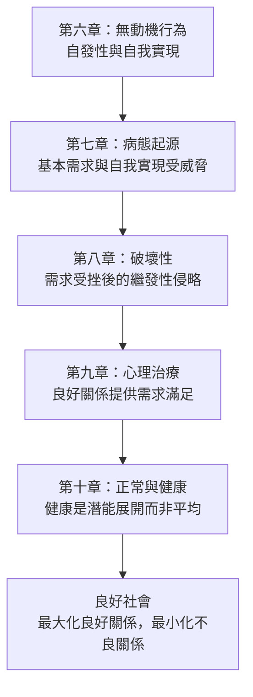

# 《動機與人格》第九章：心理治療作為一種良好的人際關係

> 來源：使用者提供之《動機與人格》第九章〈心理治療作為一種良好的人際關係〉Notion 初整理。  
> 頁碼：約 164–191。  
> 用途：補強星盤與星骰中的「治療關係、需求滿足、人際療癒、頓悟、自我治療、良好社會」解讀。  
> 整理原則：本文為二次整理版本，避免逐字搬運原書內容，重點放在心理學概念與星盤／星骰應用。

---

## 一、本章核心重點

### 1. 心理治療的核心目標是自我實現

心理治療不只是消除症狀，也不只是讓人恢復社會功能。更深層的目標是幫助一個人朝向自我實現，讓潛能、真實感受與生命方向逐漸展開。

因此，治療可以理解為協助人從匱乏、防衛與受阻狀態，走向更完整的人格發展。

### 2. 基本需求大多只能透過他人滿足

安全感、歸屬感、愛、尊重等基本需求，多數情況下必須在人際關係中獲得。這代表心理治療不是單純技術，而是一種特殊的人際關係。

治療的力量來自：當事人在關係中重新經驗到被接住、被理解、被尊重與被允許。

### 3. 有效治療師常具備相似人格特質

不同治療學派可能有不同理論與方法，但有效治療者常有相似的人格品質，例如溫暖、真誠、關心、尊重、安全感與願意聆聽。

這說明技術重要，但人格品質與關係品質更是治療效果的核心。

### 4. 未經訓練的人也可能有療癒力

牧師、老師、好友、家庭醫師、長輩或伴侶，有時也能產生療癒效果。原因是他們提供了某些基本需求的滿足，尤其是愛、尊重、接納與安全感。

這並不是否定專業治療，而是提醒我們：療癒並不只存在於診療室，也存在於日常關係。

### 5. 良好的人際關係是治療的基本媒介

馬斯洛將人際關係大致區分為三種：

```text
控制與支配
平等與尊重
疏離或放任
```

治療關係應盡量朝向平等、尊重、真誠與安全，而不是控制、評判或冷漠。

### 6. 友誼與愛是治療關係的原型

良好的友誼、愛與陪伴，能讓人感受到被愛、被接受、有歸屬、有價值。這些正是基本需求被滿足的直接途徑。

因此，良好關係本身就像一種心理營養，能修復人格中的匱乏與防衛。

### 7. 自我治療是真實存在的

日常生活中的婚姻、友誼、工作、育兒、師生關係與社群連結，都可能具有療癒作用。

正式心理治療只是把這種本來存在於人際與生活中的療癒過程，加速、聚焦並系統化。

### 8. 好的社會是良好關係的延伸

若良好人際關係能滿足人的基本需求，那麼好的社會就應該最大化良好關係，最小化不良關係。

這代表心理健康不只是個人問題，也關係到家庭、教育、工作制度、文化與社會結構。

### 9. 頓悟不只是想通，而是整體轉變

真正有效的頓悟不只是認知上明白，也要包含情感上的感受與意動層面的行動傾向改變。

也就是說，真正的改變不是只說「我懂了」，而是整個人都開始以不同方式感覺、選擇與行動。

### 10. 心理治療可以成為社會改變力量

如果心理治療能普及，它不只是幫助個人，也可能對抗病態社會壓力，成為社會改變的一種力量。

一個更健康的社會，應該讓更多人在日常生活中獲得安全、愛、尊重與自我實現的支持。

---

## 二、心理學概念

### 治療作為需求滿足

**白話意思：** 心理治療之所以有效，不只是因為技術，而是因為它提供了安全、愛、尊重、理解與接納。

**跟需求、動機、人格的關係：** 這將心理治療直接連回需求層次理論。任何能夠穩定滿足基本需求的關係，都具有一定程度的療癒功能。

**星盤／星骰應用：** 對應月亮、金星、第四宮、第七宮、第十二宮。若星骰出現這些元素，問題可能不是需要更多分析，而是需要被理解、被接住、被尊重。

---

### 良好的人際關係（Good Human Relations）

**白話意思：** 一段讓人感到安全、被愛、有價值、被尊重的人際關係，本身就具有心理治療效果。

**跟需求、動機、人格的關係：** 基本需求主要在人際關係中被滿足，因此良好關係不是附屬品，而是人格健康的基礎條件。

**星盤／星骰應用：** 對應月亮、金星、第七宮、第十一宮。感情與人際問題中，要判斷這段關係是否真的滋養需求，還是只帶來控制、依附或消耗。

---

### 未經訓練的治療者的成功

**白話意思：** 有些非專業者也能療癒人，因為他們提供了真實的人際溫暖、接納、尊重與陪伴。

**跟需求、動機、人格的關係：** 治療力不只來自知識，也來自人格特質。愛、尊重、真誠與關心，是需求被滿足的重要媒介。

**星盤／星骰應用：** 對應海王星、月亮、金星、木星、第十二宮。若星骰顯示非正式的支持者，可能代表朋友、老師、長輩或靈性陪伴比技術性分析更有幫助。

---

### 頓悟（Insight）的三個層次

**白話意思：** 真正的頓悟不只是頭腦想通，也要情感上感受到，並且在行動傾向上開始改變。

**跟需求、動機、人格的關係：** 單純認知理解不一定改變人格。只有認知、情感、意動三層同時鬆動，深層性格結構才會真正改變。

**星盤／星骰應用：** 對應水星、月亮、火星、冥王星。水星是理解，月亮是感受，火星是行動，冥王星是深層重組。

---

### 自我治療與日常生活作為治療

**白話意思：** 婚姻、友誼、工作、育兒、師生關係與日常生活經驗，也可能成為療癒來源。

**跟需求、動機、人格的關係：** 人格健康不是只靠診療室建立，而是在日常關係中不斷被滋養、修復、挑戰與整合。

**星盤／星骰應用：** 對應月亮、金星、第六宮、第七宮、第十一宮。若星骰出現六宮或十一宮，療癒可能來自日常工作、穩定生活、朋友群或社群支持。

---

### 良好社會（Good Society）

**白話意思：** 好的社會是能最大化良好關係、最小化不良關係，並支持人的基本需求與潛能發展的社會。

**跟需求、動機、人格的關係：** 社會結構本身可以成為集體性的需求滿足機制，也可能成為集體性的需求剝奪機制。

**星盤／星骰應用：** 對應木星、土星、第九宮、第十宮、第十一宮。若問題涉及組織、學校、職場或社群，要判斷該環境是在療癒人，還是在耗損人。

---

## 三、有效治療師的人格特質清單

有效的治療者通常不只是懂理論，也具備下列特質：

```text
溫暖
真誠
關心
尊重
安全感
願意聆聽
穩定
不急著評判
能接住情緒
能給予基本信任
能讓對方感覺自己有價值
```

星骰應用：如果問題問「誰能幫我」或「我該找什麼樣的人協助」，可以優先尋找具備上述特質的人，而不只是看頭銜或技術。

---

## 四、治療關係三分法

| 關係類型 | 核心特徵 | 可能結果 | 占星對應 |
|---|---|---|---|
| 控制與支配 | 不平等、命令、壓迫、評判 | 加深防衛與依附 | 土星、冥王星、第八宮、第十宮 |
| 平等與尊重 | 接納、聆聽、界線、支持 | 滿足需求、促進成長 | 金星、月亮、木星、第七宮、第十一宮 |
| 疏離或放任 | 冷漠、缺席、沒有回應 | 需求仍未被滿足 | 海王星、土星、第十二宮 |

---

## 五、月亮—金星—土星需求滿足模式

### 月亮：需要被接住

月亮代表安全感、情緒需求、依附與被照顧。治療關係中的月亮，是那個需要被理解、不被評判、可以放下防衛的部分。

### 金星：需要被喜歡與被尊重

金星代表愛、接納、價值感與關係品質。良好關係中的金星，讓人感受到自己值得被愛、值得被善待，也能與他人建立互惠連結。

### 土星：關係中的規則與權力

土星代表界線、結構、責任與權威。健康土星提供安全框架；失衡土星則可能變成控制、支配、批判或讓人不敢表達。

### 統整判斷

```text
月亮健康 = 我可以安心感受
金星健康 = 我值得被愛與尊重
土星健康 = 關係有界線、有穩定、有承諾
```

若三者失衡，治療關係或親密關係可能變成：

```text
月亮受傷 = 情緒不敢表達
金星受傷 = 感覺不值得被愛
土星過重 = 關係被控制或評判
土星不足 = 關係缺乏界線與穩定
```

---

## 六、星骰心理分析補強模板

```text
1. 這個問題需要技術解法，還是需要關係支持？
2. 當事人缺的是安全感、愛、尊重，還是自我實現方向？
3. 現在身邊是否有良好人際關係能提供需求滿足？
4. 這段關係是控制與支配、平等尊重，還是疏離放任？
5. 當事人是否只有認知上理解，情感與行動尚未改變？
6. 這個問題能否透過友誼、伴侶、師生、社群或工作獲得療癒？
7. 若要尋求協助，對方是否具備溫暖、真誠、尊重、聆聽與穩定？
```

---

## 七、六章邏輯鏈：從自我實現到良好社會



---

## 八、塔羅與六爻延伸

### 塔羅對應可能

```text
星星 = 療癒、希望、信任恢復
教皇 = 導師、神職人員、非正式治療者、價值引導
聖杯六 = 被照顧、友誼、童年需求被溫柔接住
聖杯二 = 平等互惠的療癒關係
節制 = 關係中的調和與修復
```

### 六爻延伸可能

```text
應爻生世 = 他人滋養自己，類似良好治療關係
應爻剋世 = 他人壓迫自己，類似控制與支配
世應比和 = 平等互動、互相理解
應爻空亡 = 他人缺席、疏離或無法回應需求
用神得生 = 核心需求被支持
用神受剋 = 核心需求在關係中受阻
```

---

## 九、前十章閱讀路徑

| 章節 | 核心問題 | 星盤／星骰用途 |
|---|---|---|
| 導論 | 人為什麼會想要？ | 看動機本質、無意識、多重動機 |
| 第二章 | 人的需求如何分層？ | 判斷問題屬於哪一層需求 |
| 第三章 | 需求滿足後會如何改變人？ | 看人格健康、自我實現、後設病態 |
| 第四章 | 哪些需求接近天生本性？ | 看真自我、偽自我、文化壓抑 |
| 第五章 | 高階需求有什麼意義？ | 看成長價值、愛的認同、功能自主性 |
| 第六章 | 人是否可以不被匱乏推動？ | 看表現行為、自發性、後設需求 |
| 第七章 | 什麼會真正致病？ | 看威脅、剝奪、威脅性衝突 |
| 第八章 | 破壞性是本能嗎？ | 看憤怒、侵略性、需求受挫反應 |
| 第九章 | 治療為什麼有效？ | 看關係、需求滿足、療癒力 |
| 第十章 | 什麼是正常和健康？ | 看被動適應、固有人性、潛能展開 |

---

## 十、後續二次加工重點

1. 將「良好人際關係」整合進感情星骰 SOP。
2. 建立「月亮—金星—土星」需求滿足模式獨立頁。
3. 建立「治療關係三分法」在人際、親密關係與師生關係中的應用表。
4. 將頓悟三層次對應水星、月亮、火星、冥王星。
5. 將良好社會概念連結到第十章優心態國度、木星、十一宮與水瓶座。

---

## 十一、暫定使用原則

1. 不要把治療只理解成技術，也要看關係品質。
2. 感情與人際問題中，要優先判斷這段關係是否滿足安全、愛與尊重需求。
3. 若星骰出現月亮、金星、七宮、十一宮，要檢查是否有療癒性關係存在。
4. 若星骰出現土星、冥王星，要檢查關係是否變成控制與支配。
5. 若星骰出現海王星或十二宮，要檢查是溫柔療癒，還是疏離、放任與界線模糊。
6. 真正的頓悟要同時包含理解、感受與行動改變。
